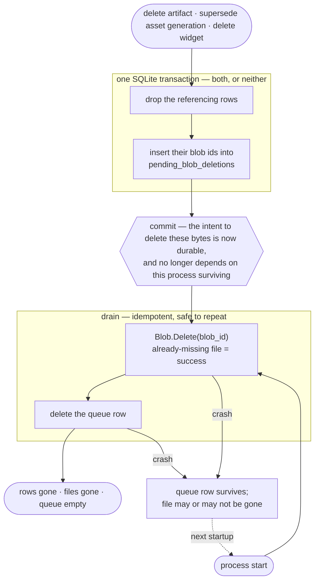

# Blob deletion queue: make byte reclamation exact and automatic

There is no durable record of an intent to delete bytes, so a crash between "the row is gone" and "the file is gone" leaks a blob permanently, with nothing able to find it afterwards.

[[av-20fk]] makes this concrete: it deletes superseded asset blobs inline, after the transaction commits. The ordering is deliberate — the alternative leaves rows pointing at files that are already gone, which is worse — but it means the window exists.

The fix is not to go looking for strays later. The deleting code already knows exactly which blobs it meant to remove; it should write that down.

## Design

**A deletion queue.** Deleting bytes spans two stores (rows in SQLite, files on disk) and cannot be atomic, so make the *intent* durable rather than trying to detect the failure afterwards:

- The transaction that removes an artifact, an asset generation, or a widget also inserts those blob ids into `pending_blob_deletions(blob_id, created_at)`. One transaction, so the intent is recorded exactly when the last reference disappears.
- After commit, delete the files, then delete their queue rows.
- A crash anywhere leaves the queue rows in place. Drain at startup and after each delete operation. `blob.Store.Delete` is already idempotent for a missing id ([[av-7jcq]]), so re-running costs nothing and needs no compensating check.

The shape to read off it: the only irreversible step is the commit, and what the commit makes durable is the *intent*, not the outcome. Everything after it is a retry of the same idempotent work, so there is no state a crash can leave that the next startup cannot finish. The two crash edges converge on one state — a surviving queue row — because that is the only state a crash can produce.

**No full scan, anywhere in the product.** A reconciler that walks the blob store and *infers* deletability from a missing reference is the wrong shape: a bug in the inference — a table it forgot to join, a query returning nothing under load — deletes live artifacts, and its cost grows with the library. The queue inverts that. It contains only ids something already decided to delete, so a bug in the drainer can reach nothing but condemned bytes, and it costs nothing when idle because it is normally empty.

**Historical orphans are an operations task, not a product feature.** [[av-7jcq]] added `Delete` without backfilling, so artifacts deleted before it shipped left bodies on disk in existing deployments. That is a one-off on a known volume, handled with a throwaway script against production if it is ever worth the space — not a command shipped in the binary forever to solve a problem that happened once. Asset blobs have no equivalent backlog: [[av-20fk]] is unreleased, so the queue is in place before the first asset blob is ever written.

## Acceptance Criteria

- Deleting an artifact removes its body, widget, and asset blobs with no manual step and no scan.
- Killing the process between the delete transaction and the file unlink leaves the blob ids queued, and the next startup removes the files. Asserted by a test simulating the crash, since this is the only reason the queue exists.
- Draining twice is harmless, and a queued id whose file is already gone drains successfully.
- The queue never contains a blob id still referenced by a live row — asserted directly, as it is the property that makes automatic draining safe.
- Docs describe it as automatic and invisible; there is no operator command to run.

## Notes

**2026-08-17T04:43:45Z**

Dropped the full-scan sweep entirely — no reconciler in the product. The queue is the whole mechanism. Pre-av-7jcq orphaned bodies are a one-off ops script against prod, not a shipped command; asset blobs have no backlog since av-20fk is unreleased.
