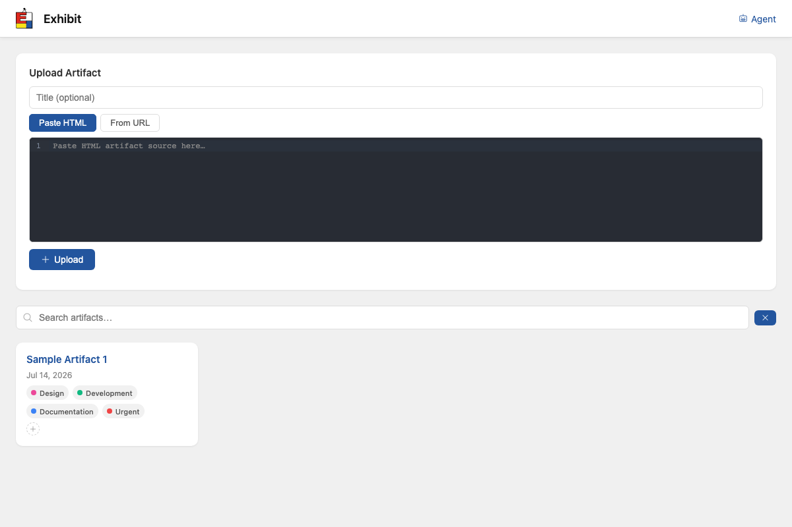

# Exhibit


Exhibit is a personal library for self-contained web tools — the kind generated by Claude Code, Gemini CLI, ChatGPT, and Claude Artifacts.

Save, organize, search, and re-run single-file HTML+JS tools. Each artifact runs in a sandboxed iframe on an isolated origin with a per-artifact Content Security Policy. State (localStorage, sessionStorage) syncs through the server so tools simple 'serverless' projects have a shared data state across all your devices.



## Quick start

```bash
# Run with defaults (SQLite in ./data, auth token: dev-token)
go run ./cmd/server

# Open the gallery
open http://localhost:8080
```

Set `AUTH_TOKEN` to something real before exposing to a network.

## Configuration

All config is via environment variables:

| Variable | Default | Description |
|----------|---------|-------------|
| `ADDR` | `:8080` | App server listen address |
| `RENDER_ADDR` | `:8081` | Render surface listen address |
| `APP_ORIGIN` | `http://localhost:8080` | Public URL of the app |
| `RENDER_ORIGIN` | `http://localhost:8081` | Public URL of the render surface (must be a different origin) |
| `AUTH_TOKEN` | `dev-token` | Bearer token for all API calls |
| `DATA_DIR` | `./data` | Directory for SQLite DB and blob storage |

The app and render surface are two route groups in one process. Point two hostnames at the same port and set `APP_ORIGIN`/`RENDER_ORIGIN` accordingly — the render origin separation is what keeps artifact code from touching the app's cookies and storage.

## API

All routes require `Authorization: Bearer <token>` except public share links.

### Artifacts

```
POST   /api/artifacts              Ingest an artifact
GET    /api/artifacts              List artifacts (?q=search&tags=a,b&collections=c)
GET    /api/artifacts/:id          Get artifact metadata (?body=true for source)
PATCH  /api/artifacts/:id          Update title, network_allowlist, etc.
DELETE /api/artifacts/:id          Delete artifact and blob
```

**Ingest flow** — two steps by design:

```bash
# Step 1: scan (no network_allowlist → returns footprint, saves anyway)
curl -X POST http://localhost:8080/api/artifacts \
  -H "Authorization: Bearer dev-token" \
  -H "Content-Type: application/json" \
  -d '{"title":"My Tool","body":"<html>...</html>"}'

# Response includes network_footprint (origins the artifact references)
# Approve them by patching the allowlist:
curl -X PATCH http://localhost:8080/api/artifacts/<id> \
  -H "Authorization: Bearer dev-token" \
  -H "Content-Type: application/json" \
  -d '{"network_allowlist":["https://cdn.jsdelivr.net"]}'
```

Or approve at ingest time:

```bash
curl -X POST http://localhost:8080/api/artifacts \
  -H "Authorization: Bearer dev-token" \
  -H "Content-Type: application/json" \
  -d '{"title":"My Tool","body":"<html>...</html>","network_allowlist":["https://cdn.jsdelivr.net"]}'
```

### State (cross-device sync)

```
GET  /api/artifacts/:id/state      Get all state key-value pairs
PUT  /api/artifacts/:id/state      Set one key {"key":"...","value":"..."}
```

The storage shim intercepts `localStorage`/`sessionStorage` in the iframe. Reads are served from state **inlined into the shim at render time** (so `getItem` is correct synchronously); writes are **`postMessage`-ed to the host frame**, which performs the authenticated `PUT` above (the sandboxed iframe has an opaque origin and can't call the API itself). No artifact changes needed — any tool that uses standard storage APIs gets cross-device sync automatically.

### Collections & Tags

```
GET    /api/collections                              List collections
POST   /api/collections                              Create collection {"name":"..."}
POST   /api/artifacts/:id/collections/:collectionID  Add to collection
DELETE /api/artifacts/:id/collections/:collectionID  Remove from collection

GET    /api/tags                                     List tags
POST   /api/tags                                     Create tag {"name":"..."}
POST   /api/artifacts/:id/tags/:tagID                Add tag
DELETE /api/artifacts/:id/tags/:tagID                Remove tag
```

### Shares

```
POST   /api/shares                 Create share {"artifact_id":"...","public":true}
DELETE /api/shares/:id             Delete share
GET    /s/:shareID                 View shared artifact (no auth)
```

Share links resolve on the render origin, under the artifact's own CSP. No account needed to view a share.

### Render surface

```
GET  /a/:artifactID    Serve artifact (render origin only)
GET  /s/:shareID       Serve shared artifact (render origin only)
```

The render surface sets `Content-Security-Policy` from the artifact's `network_allowlist`, injects the storage shim with the artifact's state inlined, and serves the document `Cache-Control: no-store`. The iframe has `sandbox="allow-scripts"` without `allow-same-origin`, giving it an opaque origin.

## Building

```bash
make build       # produces bin/server
make test        # go test ./...
make run         # go run ./cmd/server
make lint        # golangci-lint run ./...
```

### Linting

`make lint` runs [golangci-lint](https://golangci-lint.run) (config in
`.golangci.yml`). The linter is **not** vendored or embedded, so install it
yourself once:

```bash
go install github.com/golangci/golangci-lint/v2/cmd/golangci-lint@v2.6.0
# ensure $(go env GOPATH)/bin is on your PATH, then:
make lint
```

See the [official install guide](https://golangci-lint.run/welcome/install/) for
alternatives (Homebrew, the install script, CI setup).

Docker:

```bash
docker build -t artifact-viewer .
docker run -p 8080:8080 -p 8081:8081 \
  -e AUTH_TOKEN=changeme \
  -e APP_ORIGIN=https://app.example.com \
  -e RENDER_ORIGIN=https://artifacts.example.com \
  -v artifact-data:/data \
  artifact-viewer
```

## Security model

- Artifacts run in the visitor's browser, never on the server. The server stores and serves a file.
- The render origin is separate from the app origin — artifact code cannot read app cookies, real-origin storage, or make authenticated same-origin requests.
- Each artifact has a `network_allowlist` (JSON array of origins). The render surface generates a `Content-Security-Policy` from this list. Everything else is blocked by the browser.
- The static scan at ingest time is transparency, not enforcement — it surfaces the network footprint for approval. The CSP is the wall.

## Storage

- **Metadata, search, state, shares:** SQLite (`data/app.db`), WAL mode, FTS5 for full-text search. Migrations run automatically on startup via goose.
- **Artifact bodies:** filesystem (`data/blobs/`). The `Blob` interface (`internal/blob/blob.go`) is designed to swap in S3/MinIO later without touching callers.

## Project layout

```
cmd/
  server/     main entry point
internal/
  api/        HTTP handlers, router, middleware
  blob/       Blob store interface + filesystem implementation
  render/     Render surface handler (CSP, state inlining, shim injection)
  scanner/    Ingest scanner (extracts network origins from HTML)
  store/      Store interface, SQLite implementation, migrations
web/
  templates/  gallery.templ
```
