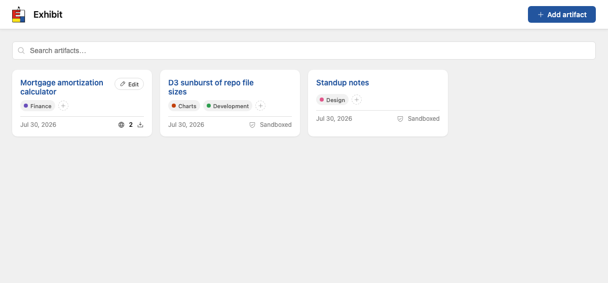

# Exhibit


> [!WARNING]
> This is in very early development and there will be future breaking changes.
> If you want to start using now, beware there are risks. Do not trust it to persist your data.

Exhibit is a personal gallery for your self-contained web tools. The little HTML micro-apps that can make your life a little better.

Save, organize, search, and re-run single-file HTML+JS tools. Each artifact runs in a sandboxed iframe on an isolated origin with a per-artifact Content Security Policy. State written to `localStorage` syncs through the server, so simple 'serverless' tools share one data state across all your devices (`sessionStorage` stays ephemeral, as it should be).



## Quick start

The fastest way to run Exhibit is Docker Compose. Read **[docs/deployment.md](./docs/deployment.md)**.

The rest of this section is for building and running **from source** for
development.

### Prerequisites

Building from source needs two toolchains that aren't installed by default on most
systems:

| Tool | Version | Why |
|------|---------|-----|
| [Go](https://go.dev/dl/) | 1.25+ | Compiles the server (the only runtime dependency). |
| [Node.js](https://nodejs.org/) + npm | 22+ | **Build-time only** — bundles assets (such as [CodeMirror](https://codemirror.net/), [Phosphor](https://phosphoricons.com/)) before runtime via (`make assets`). Not needed to *run* the server. |

`make` and a POSIX shell are also required (preinstalled on Linux; on macOS, install the
Xcode Command Line Tools with `xcode-select --install`).

Optional:

- [`golangci-lint`](https://golangci-lint.run) — only for `make lint` (see [Linting](#linting)).
- [`pi`](https://github.com/badlogic/pi-mono) — only for the AI agent surface; if absent,
  that surface disables itself and nothing else changes.

```bash
# Build and run (first build bundles CodeMirror and Phosphor assets)
make build && ./bin/server

# Or for development:
make assets && go run ./cmd/server

# Open the gallery
open http://localhost:8080
```

With no env vars set it defaults to `localhost` origins and a `dev-token` auth
token, which is fine locally. Set `AUTH_TOKEN` and the origins before exposing it
to a network — see [docs/deployment.md](./docs/deployment.md) for the full
configuration reference.

## Building

```bash
make build       # produces bin/server
make test        # go test ./...
make run         # go run ./cmd/server
make lint        # golangci-lint run ./...
```

### Linting

`make lint` runs [golangci-lint](https://golangci-lint.run) (config in
`.golangci.yml`). The linter is **not** vendored or embedded, so install it
yourself once:

```bash
go install github.com/golangci/golangci-lint/v2/cmd/golangci-lint@v2.6.0
# ensure $(go env GOPATH)/bin is on your PATH, then:
make lint
```

See the [official install guide](https://golangci-lint.run/welcome/install/) for
alternatives (Homebrew, the install script, CI setup).

## API

The full HTTP API reference — every route plus the ingest, network-allowlist,
state (cross-device sync), collection/tag, agent, sharing, and render-surface
flows — lives in [docs/api.md](./docs/api.md).

## Security model

Full stance — CSP, vendoring, clipboard/file defaults — in [docs/security.md](./docs/security.md). In brief:

- Artifacts run in the visitor's browser, never on the server. The server stores and serves a file.
- The render origin is separate from the app origin — artifact code cannot read app cookies, real-origin storage, or make authenticated same-origin requests.
- Each artifact has a `network_allowlist` (JSON array of origins). The render surface generates a `Content-Security-Policy` from this list. Everything else is blocked by the browser.
- The static scan at ingest time is transparency, not enforcement — it surfaces the network footprint for approval. The CSP is the wall.

## Storage

- **Metadata, search, state, shares:** SQLite (`data/app.db`), WAL mode, FTS5 for full-text search. Migrations run automatically on startup via goose.
- **Artifact bodies:** filesystem (`data/blobs/`). The `Blob` interface (`internal/blob/blob.go`) is designed to swap in S3/MinIO later without touching callers.

## Debug mode

Set `DEBUG=1` (or `LOG_LEVEL=debug`) to enable verbose, leveled logging for test
environments. In debug mode every HTTP request is logged with the remote
address, response size, query string, and request id, and the ingest/render/
store/blob/scanner/snapshot seams emit trace-level detail — artifact creates,
state writes, CSP built per artifact, scanned origins, and snapshot asset
fetches. At the default `info` level the service stays quiet except for a one
line per request (promoted to `warn` on 4xx and `error` on 5xx) and lifecycle
events. Logs are structured text via `log/slog` to stdout.

## Project layout

```
cmd/
  server/     main entry point
  mockllm/    serves internal/mockllm as a standalone process
internal/
  agent/      Pi sidecar session manager + exhibit tools extension (ext/exhibit.ts)
  agentscope/ Per-session agent credentials the API resolves to one artifact
  api/        HTTP handlers, router, middleware, gallery + agent chat pages
  blob/       Blob store interface + filesystem implementation
  color/      Brand color constants
  mockllm/    Deterministic OpenAI-compatible stand-in LLM for agent tests
  render/     Render surface handler (CSP, state inlining, render preamble + snippet injection)
  scanner/    Ingest scanner (extracts network origins from HTML, base-aware)
  secrets/    AES-GCM sealing for BYO agent API keys
  snapshot/   URL-ingest asset vendoring (bounded fetch, HTML/CSS inlining, <base href>)
  store/      Store interface, SQLite implementation, migrations
web/          Build-time asset workspaces (see docs/build_assets.md)
  editor/     CodeMirror editor bundle (esbuild)
  icons/      Phosphor Icons vendoring
scripts/
  build-assets.sh  Builds web/* workspaces into internal/api/assets/
```
