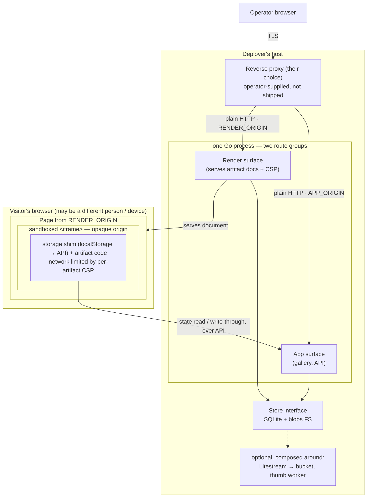
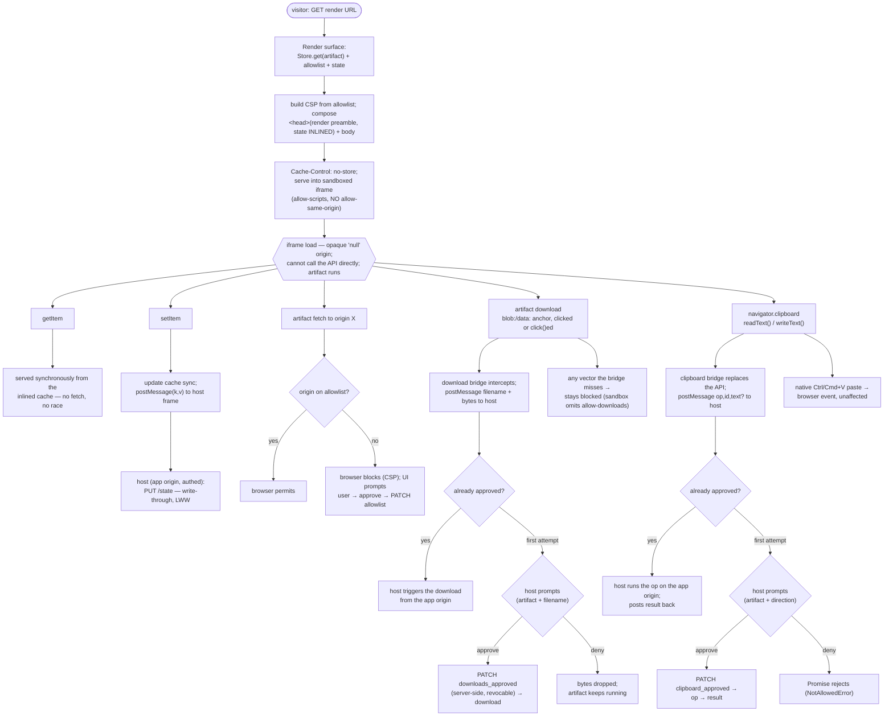

# Exhibit — Architecture

Companion to `product_requirement_doc.md` (the *what* and the boundaries) and
`technical_stack.md` (the *with what*). This document describes *how the
system is structured* — components, boundaries, data flow, and the request lifecycles
that matter. It assumes the decisions already made: Go service, single SQLite file,
blob store behind an interface, sandboxed-iframe renderer on a separate origin,
scan→allowlist→CSP network model, and the unconditional storage shim.

## 1. Architectural principles

Five rules shape every structural decision. When a choice is ambiguous, these decide it.

1. **It's just a file.** A tier-1/2 artifact is a self-contained document that runs in
   the *visitor's* browser. The service stores and serves it; it never executes artifact
   code. This is why the system stays small and why artifacts are durable.
2. **One write path.** Every mutation — upload, paste, future extension, state
   write-through — enters through the HTTP API. Nothing writes the datastore directly.
   This single seam is where auth, validation, and (later) replication and multi-user
   all attach.
3. **Two origins, hard boundary.** The app and the artifacts it renders live on
   different origins. The trust boundary between "our application" and "untrusted
   artifact code" is an origin boundary enforced by the browser, not a code convention.
4. **Observe, don't predict.** The system never analyzes an artifact ahead of time to
   guess its behavior (storage use, network use). It installs interceptors and policy at
   the runtime boundary and observes what actually happens.
5. **Easy path and serious path share one system.** Single-user/local and
   replicated/multi-user are the *same* binary and schema with optional pieces composed
   around them. No forks, no rewrites — seams placed early (owner_id, Store interface,
   single write path) make the upgrades additive.

## 2. System context



The same Go process answers both origins; they are route groups, not separate services.
The proxy that maps hostnames to the process and terminates TLS is the operator's, per
the tech-stack doc.

## 3. Components and responsibilities

### 3.1 API surface (the single write path)

The only way data changes. Route groups:

- `POST /api/artifacts` — ingest. Accepts a document body + metadata, **or a source
  URL** the service fetches once and stores as a file (the URL is persisted as
  `source_url`); runs the scan, returns the network footprint for approval, persists
  immediately (network-inert with `connect-src 'none'` until the allowlist is
  patched).
- `GET /api/artifacts`, `GET /api/artifacts/:id` — list/detail (drives the gallery).
- `PATCH /api/artifacts/:id` — edits: title, body (rewrites the stored blob),
  `network_allowlist`, `downloads_approved` / `clipboard_approved` (the capability
  bridge's first-use approvals, §6), and other scalar columns. Rewriting the body
  re-executes the scan and returns the footprint plus a `footprint_changed` flag so
  the edit dialog can re-run the explicit-approval gate when origins differ from the
  previous version; the allowlist is never seeded from that scan (spec §6.2).
  Tag and collection membership use the dedicated `POST/DELETE
  /api/artifacts/:id/tags/:tagID` and `.../collections/:colID` routes.
- `POST /api/artifacts/:id/refetch` — for URL-ingested artifacts, re-fetches
  `source_url` and replaces the stored body. A snapshot, not a versioned update.
- `DELETE /api/artifacts/:id` — deletes the artifact and associated rows (tags,
  collections, shares, state cascade via FK). The blob body on the filesystem is
  orphaned in v1 (`Blob.Store` has no `Delete` method).
- `GET/PUT /api/artifacts/:id/state` — the storage shim's state endpoint (§6). Reads are
  normally satisfied by render-time inlining, not this route; `PUT` is called by the
  **host frame** on the storage shim's behalf (the sandboxed iframe can't reach the API itself).
  Authenticated like every other mutating route.
- `POST /api/shares`, `DELETE /api/shares/:id` — share lifecycle.
- collection/tag CRUD.

Middleware chain (via `chi`): request logging → auth (static token now, sessions later)
→ owner scoping (`owner_id`, fixed to 1 now) → handler. Auth and ownership are *one
layer* every mutating route passes through, which is what makes multi-user a
middleware-and-data change rather than a rewrite.

### 3.2 Render surface

A read-only surface on `RENDER_ORIGIN` whose entire job is to emit an artifact as an
executable document with the correct security envelope:

- Looks up the artifact, pulls its body from the blob store, its `network_allowlist`, and
  its current state.
- Generates the per-artifact CSP (`connect-src`/`script-src`/`style-src`/`img-src`/
  `font-src` from the allowlist) and sets it as a response header on the document.
  `connect-src` is the allowlist alone — the storage shim needs no network of its own (§6).
  Style/font defaults are permissive for *inlined* assets but strict for *network*
  ones, matching the "it's just a file" thesis: `style-src` always carries
  `'unsafe-inline'` (inline `<style>` blocks and `style=""` attributes never need
  network approval), and `img-src`/`font-src` always carry `data:` so an artifact
  that inlines its own images or fonts (`@font-face { src: url(data:…) }`) renders
  with zero network egress. Loading a stylesheet, image, or font *from a remote
  origin* still requires that origin on the allowlist — the network boundary is
  unchanged; only inlined, no-egress assets are permitted by default.
- Injects the **render preamble** as the first `<head>` script(s) — the **storage
  shim** with the artifact's state **inlined** into it so `getItem` is correct
  synchronously, plus the download/clipboard **capability bridges** — then the
  artifact body. (Umbrella/family taxonomy: `security.md` §4.)
- Sets `Cache-Control: no-store` — the document is dynamic (inlined state + per-artifact
  CSP) and must never be served stale from a cache.
- Is loaded by the app's pages as the `src` of a sandboxed iframe
  (`<iframe src="RENDER_ORIGIN/a/:id" sandbox="allow-scripts">`) with **no**
  `allow-same-origin`. Capabilities the opaque-origin sandbox denies — downloads
  (`allow-downloads` omitted) and `navigator.clipboard` read/write (Permissions
  Policy) — are not re-granted on the frame; they are proxied through the host
  frame by the render preamble's **capability bridges**, gated by per-artifact first-use
  approval (`downloads_approved` / `clipboard_approved`, §6). A prior
  `allow="clipboard-read; clipboard-write"` delegation was a no-op — Permissions
  Policy `allow=` keys on the frame's opaque src origin, which matches nothing —
  so it was removed. Native keyboard paste (Ctrl/Cmd+V) is a browser event and
  works regardless.

The render surface never mutates anything. It reads (including state, to inline it), wraps,
and serves. This read-only property is what makes it safe to expose under the no-auth share
path (§7).

### 3.3 Store interface

The seam between handlers and persistence. Handlers speak only to this interface:

```
Store:  put/get/list/search artifacts, collections, tags, shares; get/put state
Blob:   put/get artifact bodies by id
```

- **Metadata, collections, tags, shares, state** → SQLite (one file, WAL mode).
- **Search** → an FTS5 table over artifact titles.
- **Bodies** → filesystem now, S3-compatible later — same `Blob` interface.

Because handlers never touch SQLite or the filesystem directly, swapping the metadata
engine (libSQL/Turso) or the blob backend (S3/MinIO) is a backend implementation change
behind a stable interface.

### 3.4 Ingest scanner

Invoked by `POST /api/artifacts`. Parses the document with a real HTML tokenizer
(`x/net/html`) to extract referenced origins (`src`/`href`/`action`/`<link>`/ESM
imports), plus a literal-URL heuristic over inline JS. Produces the deduplicated origin
list for the approval step. It is **transparency, not enforcement** — its output seeds
the approval step, never the allowlist directly; the CSP is the wall. For a URL ingest
the scan is **base-aware**: relative references are resolved against the source URL so
residual external origins still surface (a bare `Scan` drops relatives; `ScanWithBase`
resolves them).

### 3.4a Snapshot vendorer (URL ingest)

`internal/snapshot`, invoked by `POST /api/artifacts` when the request carries
`url` and `snapshot: true`. It runs **after fetch and before `Blob.put`** and turns a
fetched page into a self-contained file so the artifact honours the "it's just a file"
promise even after the source site rots:

- A single bounded **`Fetcher`** owns all fetch policy in one place — reference
  resolution against the source base, per-asset/total size caps, an asset-count cap,
  timeouts, a redirect limit, and a dial-time SSRF guard rejecting non-public addresses.
- **HTML inlining** walks the parsed tree and folds each fetchable reference into the
  document: ``/`<source>` (and `srcset`), icon `<link>`s → `data:` URIs;
  `<script src>` → inline `<script>`; `<link rel=stylesheet>` → inline `<style>`.
- **CSS inlining** recurses through `url()` and `@import` chains (each sheet re-based
  against its own URL), inlining as `data:` URIs with cycle and depth guards.
- **Partial failure is data, not an error.** Any reference that can't be inlined (404,
  over a limit, blocked address, runtime-constructed URL) keeps its original value and
  is recorded as a typed `FetchError`; the rest of the page is still vendored. The
  handler assembles these into the response's `snapshot` report (vendored URLs/bytes,
  residual origins, per-asset failures) so the user always gets a usable artifact.
- **Fallback (`<base href>`).** Whether snapshot is off, failed, or left residual
  relatives, a URL ingest injects `<base href="<source-url>">` at the top of `<head>`
  so surviving relative references resolve against the source site rather than the
  render origin. This is transform-independent option A; the CSP allowlist still governs
  whether those origins are *reachable*.

The vendorer never seeds the allowlist — residual origins go through the same explicit
approval as any other footprint (spec §6.2).

### 3.5 Gallery (web UI)

Server-rendered pages built with the stdlib `html/template`: the templates live in
`internal/api/templates/` (committed source, `go:embed`-ed), their handlers and view
models in `internal/api/gallery.go`. Each page's stylesheet and script are static
assets authored in the `web/gallery/` workspace and served under `/assets/gallery/`;
per-request values (API token, artifact id, allowlist, capability approvals) reach
the page scripts through a small inline bootstrap `<script>` the templates render,
with html/template's contextual escaping JSON-encoding them. Talks to the API
like any other client. Hosts two islands of client JS: the **CodeMirror** source
editor (an esbuild-built, `go:embed`-served bundle) and the **renderer iframe**
(which actually points at `RENDER_ORIGIN`). The gallery renders server-side,
but search filters eagerly from the client: a debounced input refetches the
same server-rendered gallery with the query and swaps only the grid, so the
FTS5 search query stays authoritative without a full page reload. Filter,
tag/collection management, and the allowlist editor are full-page server renders.

### 3.6 Optional satellites (composed around, not shipped in)

- **Litestream** sidecar → streams the SQLite WAL to a bucket; supervises restore on
  empty volume.
- **Thumbnail worker** → headless Chromium screenshotting artifacts, kept out of the main
  image.
- **Future Chrome extension** → another API client for chat-UI ingest.

### 3.7 Agent sidecar (Pi harness, Exh-yvhp)

The build/modify-with-AI surface follows the same satellite philosophy but is
spawned by the service rather than composed by the operator: each chat session
runs one `pi --mode rpc` subprocess (Pi, Mario Zechner's agent harness —
JSONL over stdin/stdout), managed by `internal/agent`. If the `pi` binary is
absent the surface degrades to disabled; nothing else changes.

- **Single write path preserved:** the sidecar is loaded with built-in tools
  disabled and exactly one extension (`internal/agent/ext/exhibit.ts`) whose
  `create_artifact` / `update_artifact` / `get_artifact` tools call back into
  the exhibit HTTP API with the service token. Agent output is scanned like
  any ingest and its footprint is never auto-approved.
- **BYO key, sealed at rest:** the user's provider key is stored AES-256-GCM
  encrypted under a server secret (`internal/secrets`, `agent_keys` table) and
  handed to the subprocess only through its (minimal, built-from-scratch)
  environment. Reads return masked hints; page JS never sees the key again.
- **Streaming:** the service fans Pi's event stream out to the browser via
  SSE (`/api/agent/sessions/:id/events`); prompts arriving mid-run become Pi
  steering messages. Transcripts are persisted per artifact
  (`agent_transcripts`) as colophon-style provenance for future remixing.
- **Trust note:** the sidecar is a subprocess of the service executing
  LLM-directed tool calls, but its reach is bounded to the same authenticated
  API surface any client has — it holds no datastore access of its own.

See `docs/agent.md` for the full flow, including snippet mode (the render
surface's element picker that feeds an element screenshot + descriptor back
into the prompt as multimodal context).

## 4. Trust boundaries

Four boundaries, in decreasing trust:

1. **Operator ↔ App API.** Authenticated (token now). The operator is trusted; this
   boundary is about identity and the single write path, not containment.
2. **App ↔ stored artifact body.** The body is untrusted data at rest. It is never
   executed server-side, never `eval`'d, only stored and later served. Treating it as
   inert bytes on our side is what keeps server-side risk near zero.
3. **Render origin ↔ visitor browser.** The artifact becomes *executing code* here — but
   in the visitor's browser, on a separate origin, inside an opaque-origin sandbox. The
   browser is the enforcer.
4. **Artifact code ↔ everything else.** The innermost and most important boundary. The
   sandbox (no `allow-same-origin`) + per-artifact CSP confine what artifact code can
   touch and reach. This boundary is *browser-enforced policy*, deliberately not our own
   code, because the browser's origin/sandbox/CSP machinery is far more battle-tested
   than anything we'd write.

The recurring theme: the hard security boundary is always pushed to the browser's native
mechanisms (origin isolation, iframe sandbox, CSP), because the server's best defense is
to never run artifact code at all.

## 5. Ingest data flow

```
client ──POST /api/artifacts (body | url [+ snapshot] + metadata)──► API
  (url ingest)  API ──► fetch page (bounded 10 MiB), extract <title>
  (snapshot on) API ──► snapshot.InlineHTMLAssets: bounded fetch + inline
                          assets as data:/inline <script>/<style>
                          ──► self-contained body + report (vendored,
                              residual, per-asset failures — never fatal)
  (url ingest)  API ──► ScanWithBase: resolve relatives vs source ──► footprint
                          ──► inject <base href> for surviving relatives
  (paste)       API ──► Scan: tokenize, extract origins ──► footprint list
  API ──► respond: "these N origins will be contacted — approve?" (+ snapshot report)
client ──confirm (+ edited allowlist)──► API
  API ──► Blob.put(body)         (untrusted bytes at rest)
  API ──► Store.put(artifact, network_allowlist=[], tier, source_url, ...)
  API ──► FTS5 index (title)
  API ──► respond: artifact id + render URL + footprint (network-inert until approved)
client ──PATCH /api/artifacts/:id (approved allowlist)──► API
  API ──► Store.update(artifact, network_allowlist) → now renderable with network egress
```

The snapshot stage runs **after fetch, before `Blob.put`** (§3.4a) and is the only
ingest-time transform; it degrades gracefully (partial failure produces a usable
artifact plus a report) and never seeds the allowlist. A fully vendored page collapses
its own network footprint toward `connect-src 'none'`.

Two-step by design: scan and surface *before* anything is renderable, so the network
footprint is a decision the user makes at the door, not a surprise at runtime.

## 6. Render + state data flow



Two properties fall out of the sandbox's opaque origin: reads are **inlined at render**
(a load-time fetch would race the artifact's synchronous startup reads), and writes are
**bridged through the host frame** (the iframe can't call the API cross-origin, so the
authenticated host does it — no CORS, state endpoint stays authed).

Downloads ride the same host-frame bridge. The sandbox deliberately omits
`allow-downloads`, so nothing in the frame downloads directly; the download bridge intercepts
the common export vectors (`blob:`/`data:` anchors — recovering `blob:` payloads
from a `createObjectURL` registry rather than a `connect-src`-governed fetch) and
transfers the bytes to the host, which owns the first-use approval prompt and, once
approved, performs the download from the app origin. The bridge is UX, not
enforcement: evading it just leaves the download sandbox-blocked. The bridge
installs only when a host frame exists — top-level renders (direct visit, shares)
have no sandbox and need no bridge.

Clipboard read/write rides the identical bridge (`clipboard_approved`): the clipboard bridge
replaces `navigator.clipboard.readText`/`writeText` and correlates each call by
id so the returned Promise settles with the host's answer; a denial rejects with
a `NotAllowedError` the artifact handles like any blocked clipboard call. Native
keyboard paste is a browser event, not an API call, so it is never bridged. See
`security.md` §4 for the full policy.

The state endpoints are why cross-device "just works": all state lives server-side, so a
second device inlines the same state at render. No replication required for this (§8 distinguishes
it from server durability).

## 7. Sharing

A share is a row (`shares(id, artifact_id, public, expires_at)`), not an export action.
`GET /s/:shareId` resolves the row and serves the artifact **through the same read-only
render surface** under the same per-artifact CSP — just without the app auth check,
because the share row *is* the authorization. This reuse is why sharing is nearly free:
it's the render path with a different front-door check. A one-file self-contained `.html`
export remains as the service-independent fallback.

## 8. Evolution seams (how the easy path becomes the serious path)

Each future capability attaches to a seam already present in v1, so none is a rewrite:

| Future need | Attaches to | Change required |
|-------------|-------------|-----------------|
| Cross-device state | state endpoints (§6) | **already done** — state is server-side |
| Multi-user | auth middleware + `owner_id` | real sessions; scope queries by owner |
| Server durability / restore | Store (SQLite + WAL) | Litestream sidecar; no app change |
| HA / multi-region reads | Store interface | libSQL/Turso behind same interface |
| Object-storage bodies | Blob interface | S3/MinIO impl behind same interface |
| Tier-2 React | Render surface | add transpile (in-iframe Babel → esbuild) |
| Chat-UI ingest | API (single write path) | Chrome extension as a new client |

The point of the table: every column-3 change is *additive* and local, because the
column-2 seam was placed deliberately in the initial build. Cross-device, the thing most
likely to be confused for needing replication, needs nothing beyond what §6 already
specifies — server-side state is the whole mechanism.

## 9. What this architecture deliberately is not

- **Not a runtime/PaaS.** No tier-3 backends, no per-artifact server processes, no
  sandbox VMs. The moment an artifact needs a live server it stops being a file and
  leaves this system's scope.
- **Not a multi-service deployment.** One Go process answers both origins; SQLite is
  embedded; the only extra processes are optional satellites composed by the operator,
  plus short-lived per-session Pi sidecars the service itself spawns for the agent
  surface (§3.7) — spawned on demand, reaped on idle, absent entirely when `pi` is
  not installed.
- **Not a predictor.** No pre-render static/LLM analysis gates behavior. Policy and
  interception sit at the runtime boundary and observe.
- **Not the owner of TLS or backup targets.** The release is the image plus a config
  contract (origins, data volume, optional Litestream env). Proxy, certs, and buckets are
  the operator's to compose.
