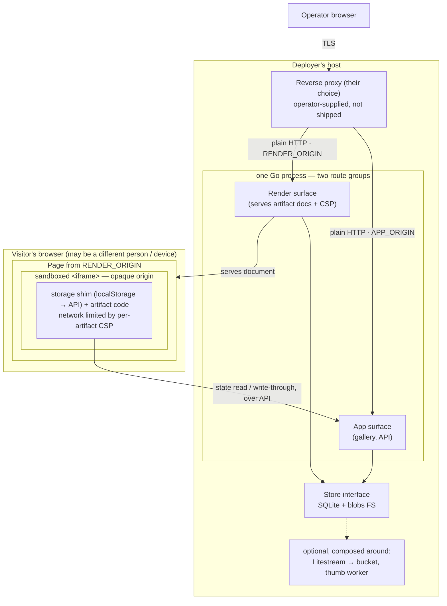
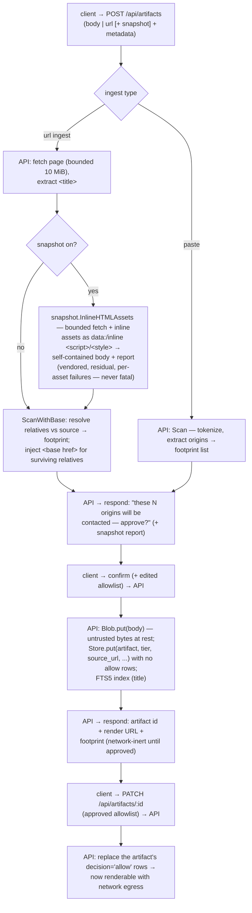
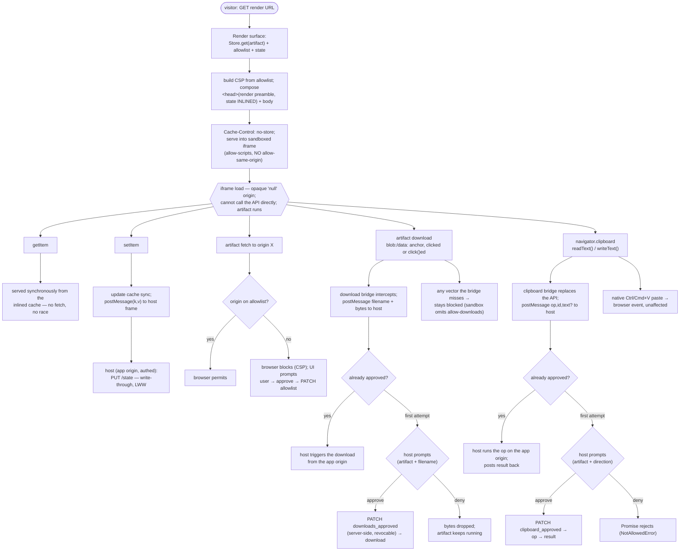

# Exhibit — Architecture

Companion to `product_requirement_doc.md` (the *what* and the boundaries) and
`technical_stack.md` (the *with what*). This document describes *how the
system is structured* — components, boundaries, data flow, and the request lifecycles
that matter. It assumes the decisions already made: Go service, single SQLite file,
blob store behind an interface, sandboxed-iframe renderer on a separate origin,
scan→allowlist→CSP network model, and the unconditional storage shim.

## 1. Architectural principles

Five rules shape every structural decision. When a choice is ambiguous, these decide it.

1. **It's just a file.** A tier-1/2 artifact is a self-contained document that runs in
   the *visitor's* browser. The service stores and serves it; it never executes artifact
   code. This is why the system stays small and why artifacts are durable.
   This is a critical part of the user's ownership of their software. They
   should be able to trivially take their software and data with them.
2. **One write path.** Every mutation — upload, paste, future extension, state
   write-through — enters through the HTTP API. Nothing writes the datastore directly.
   This is where auth, validation, and (later) replication and multi-user
   all attach.
3. **Two origins, hard boundary.** The app and the artifacts it renders live on
   different origins. The trust boundary between "our application" and "untrusted
   artifact code" is an origin boundary enforced by the browser, not a code convention.
   This is a core component of the artifact sandboxing.
4. **Observe, don't predict.** The system will not analyze an artifact ahead of time to
   _guess_ its behavior (storage use, network use). It installs interceptors and policy at
   the runtime boundary and observes what actually happens. Scanning functions may be
   done for heuristics, but never as a prescription for a contract.
5. **_DEPRECATED_** **Easy path and serious path share one system.** Single-user/local and
   replicated/multi-user are the *same* binary and schema with optional pieces composed
   around them. No forks, no rewrites — seams placed early (owner_id, Store interface,
   single write path) make the upgrades additive.
5. **Security should be simple, and by default.** The secure choice should be the default
   choice. And it should be secure by the nature of the design, not the details of the
   implementation.

## 2. System context


```mermaid
flowchart TB
    operator["Operator browser"]

    subgraph host["Deployer's host"]
        proxy["Reverse proxy (their choice)<br/>operator-supplied, not shipped"]
        subgraph goproc["one Go process — two route groups"]
            app["App surface<br/>(gallery, API)"]
            render["Render surface<br/>(serves artifact docs + CSP)"]
        end
        store["Store interface<br/>SQLite + blobs FS"]
        opt["optional, composed around:<br/>Litestream &rarr; bucket, thumb worker"]
    end

    operator -->|TLS| proxy
    proxy -->|"plain HTTP &middot; APP_ORIGIN"| app
    proxy -->|"plain HTTP &middot; RENDER_ORIGIN"| render
    app --> store
    render --> store
    store -.-> opt

    subgraph visitor["Visitor's browser (may be a different person / device)"]
        subgraph page["Page from RENDER_ORIGIN"]
            subgraph frame["sandboxed &lt;iframe&gt; — opaque origin"]
                artifact["storage shim (localStorage &rarr; API) + artifact code<br/>network limited by per-artifact CSP"]
            end
        end
    end

    render -->|serves document| page
    artifact -->|"state read / write-through, over API"| app
```

The same Go process answers both origins; they are route groups, not separate services.
The proxy that maps hostnames to the process and terminates TLS is the operator's, per
the tech-stack doc.

## 3. Components and responsibilities

### 3.1 API surface (the single write path)

The only way data changes. Route groups:

- `POST /api/artifacts` — ingest. Accepts a document body + metadata, **or a source
  URL** the service fetches once and stores as a file (the URL is persisted as
  `source_url`); runs the scan, returns the network footprint for approval, persists
  immediately (network-inert with `connect-src 'none'` until the allowlist is
  patched).
- `GET /api/artifacts`, `GET /api/artifacts/:id` — list/detail (drives the gallery).
- `PATCH /api/artifacts/:id` — edits: title, body (rewrites the stored blob),
  `network_allowlist` (accepted unchanged as the whole approved set; the store
  translates it into `decision='allow'` rows and deliberately leaves any
  `decision='block'` rows alone, §3.3), `downloads_approved` / `clipboard_approved` (the capability
  bridge's first-use approvals, §6), and other scalar columns. Rewriting the body
  re-executes the scan and returns the footprint plus a `footprint_changed` flag so
  the edit dialog can re-run the explicit-approval gate when origins differ from the
  previous version; the allowlist is never seeded from that scan (spec §6.2).
  Tag and collection membership use the dedicated `POST/DELETE
  /api/artifacts/:id/tags/:tagID` and `.../collections/:colID` routes.
- `POST /api/artifacts/:id/refetch` — for URL-ingested artifacts, re-fetches
  `source_url` and replaces the stored body. A snapshot, not a versioned update.
- `DELETE /api/artifacts/:id` — deletes the artifact and associated rows (tags,
  collections, shares, state cascade via FK). The blob body on the filesystem is
  orphaned in v1 (`Blob.Store` has no `Delete` method).
- `GET/PUT /api/artifacts/:id/state`, `DELETE /api/artifacts/:id/state[/:key]` — the
  artifact's state rows (§6). Reads are normally satisfied by render-time inlining, not
  this route; `PUT` is called by the **host frame** on the storage shim's behalf (the
  sandboxed iframe can't reach the API itself). The two `DELETE`s — one key, or all of
  an artifact's state — are the row-removal path the edit page's state inspector (§3.5)
  drives; they are idempotent (a key that was never stored is already absent) and `:key`
  is one percent-encoded path segment, since state keys are arbitrary artifact-chosen
  text. Erasing all state touches state alone: body, origin decisions, and capability
  approvals survive. All of them are authenticated like every other route here — the
  inspector adds no second write path. Every one is scoped to the session's own
  rows (av-q0ub): the session supplies both principals §3.3 describes, so a read
  never returns the union of every viewer's state and "erase all" means *mine*,
  not the artifact's.
- `GET/PUT/DELETE /api/artifacts/:id/widget` — the artifact's gallery-card widget
  (av-fafu). A second document stored beside the artifact's body and hung off the
  artifact rather than made a resource of its own, because it has no identity, no
  allowlist and no state apart from it. `PUT` scans the widget and reports which of
  its origins the *artifact's* allowlist doesn't cover — those are already blocked
  at render, so this explains a blank tile rather than gating one, and (as
  everywhere) never seeds the allowlist. See `widgets.md`.
- `POST /api/shares`, `DELETE /api/shares/:id` — share lifecycle.
- collection/tag CRUD.
- `GET /api/settings/public` — the instance's own name and description
  (av-4ac9). The one route in the `/api` namespace registered *outside* the
  authenticated group, because a visitor with no credential is exactly who
  needs it. The values are environment configuration carried on `api.Config`
  (`PUBLIC_MODE_ENABLED`, `PUBLIC_INSTANCE_NAME`,
  `PUBLIC_INSTANCE_DESCRIPTION`, `PUBLIC_OWNER_ID`) rather than a settings
  table, since the server-rendered gallery reads them on every page render and
  a table would buy nothing but a round trip. `PUBLIC_OWNER_ID` exists because
  owner scoping is a real predicate (below): an instance that publishes a
  library has to name whose. An instance with public mode off answers this
  route `404` — indistinguishable from one that never had it, and unambiguous
  for the caller, since 200-with-empty-strings already means "public, but
  unnamed".

Middleware chain (via `chi`): request logging → auth → owner scoping (`owner_id`)
→ handler. Auth accepts two credentials, in that order of preference: a session
cookie, when this instance has a login at all (§3.8), and otherwise the static
bearer token — the API/CLI credential, and the only credential a single-user
instance has. The owner is whatever the session resolved to, or `1`. Auth and
ownership are *one layer* every mutating route passes through, which is what
makes multi-user a middleware-and-data change rather than a rewrite.

**Public mode (av-wmp6)** is the one case where a request with no credential
gets past that layer, and it is deliberately narrow. When `PUBLIC_MODE_ENABLED`
is on, a request that resolved *no* credential may proceed if it is a `GET` of
`/api/artifacts` or `/api/artifacts/:id` — the published library and one
artifact in it — and nothing else. Every mutating method stays authenticated
whatever the configuration says, and so does every other read: `/state` is the
owner's data, `/transcripts` their conversations, and collections, tags,
shares, and the agent routes are never reached. The list is a deny-by-default
allowlist for the same reason the agent's is: a route added later must not
become public because nobody thought about it. Owner resolution follows in the
next middleware, which reads such a request as `PUBLIC_OWNER_ID` rather than
the default owner — since av-ep8k made owner a real predicate, "the library"
needs a named owner to mean anything. The pass is also recorded on the request
context, which is how a page render knows to suppress edit controls and to mint
render tokens that carry no principal (§3.2).

The owner the middleware supplies is a **real query predicate**, not a value the
store ignores (av-ep8k): handlers pass it into every Store method that names an
artifact, and those filter on it in SQL (§3.3). So the remaining step toward
multi-user is the middleware resolving a *different* owner — not an audit of
which queries forgot to scope.

### 3.2 Render surface

A read-only surface on `RENDER_ORIGIN` whose entire job is to emit an artifact as an
executable document with the correct security envelope:

- Looks up the artifact, pulls its body from the blob store, its approved origins
  (the artifact's `decision='allow'` rows, §3.3), and its current state.
- Generates the per-artifact CSP (`connect-src`/`script-src`/`worker-src`/`style-src`/
  `img-src`/`font-src`/`media-src` from the allowlist) and sets it as a response header
  on the document. `connect-src` is the allowlist alone — the storage shim needs no
  network of its own (§6). Every source in the policy sits in one of two buckets, and
  which bucket it belongs to is the only question a new directive raises: *network-
  reaching* sources are egress and stay allowlist-gated, while *local, no-egress*
  sources (`'unsafe-inline'`, `'unsafe-eval'`, `data:`, `blob:`) run bytes the artifact
  already carries or the visitor already picked locally and are therefore
  unconditional. That is the "it's just a file" thesis in policy form: `style-src`
  always carries `'unsafe-inline'` (inline `<style>` blocks and `style=""` attributes
  never need network approval), `img-src`/`font-src` always carry `data:` so an
  artifact that inlines its own images or fonts (`@font-face { src: url(data:…) }`)
  renders with zero network egress, `media-src` always carries `blob:` so a
  `<video>`/`<audio>` element can play back a file the artifact loaded locally via
  `<input type=file>` + `URL.createObjectURL`, and `script-src`/`worker-src` always
  carry `blob:`/`data:` so a script or Worker the artifact builds at runtime (the
  standard ffmpeg.wasm pattern) executes. `worker-src` is spelled out rather than
  left to fall back to `script-src` because its absence fails *silently* — the
  `Worker` constructor succeeds, nothing is logged, and the worker body simply never
  runs (av-x01o). Loading a script, worker, stylesheet, image, font, or media file
  *from a remote origin* still requires that origin on the allowlist — the network
  boundary is unchanged; only inlined/local, no-egress sources are permitted by
  default.
- Injects the **render preamble** as the first `<head>` script(s) — the **storage
  shim** with the artifact's state **inlined** into it so `getItem` is correct
  synchronously, plus the download/clipboard **capability bridges** — then the
  artifact body. (Umbrella/family taxonomy: `security.md` §4.)
- Sets `Cache-Control: no-store` — the document is dynamic (inlined state + per-artifact
  CSP) and must never be served stale from a cache.
- Is loaded by the app's pages as the `src` of a sandboxed iframe
  (`<iframe src="RENDER_ORIGIN/a/:id" sandbox="allow-scripts">`) with **no**
  `allow-same-origin`. Capabilities the opaque-origin sandbox denies — downloads
  (`allow-downloads` omitted) and `navigator.clipboard` read/write (Permissions
  Policy) — are not re-granted on the frame; they are proxied through the host
  frame by the render preamble's **capability bridges**, gated by per-artifact first-use
  approval (`downloads_approved` / `clipboard_approved`, §6). A prior
  `allow="clipboard-read; clipboard-write"` delegation was a no-op — Permissions
  Policy `allow=` keys on the frame's opaque src origin, which matches nothing —
  so it was removed. Native keyboard paste (Ctrl/Cmd+V) is a browser event and
  works regardless.

- Serves an artifact's **widget** at `/w/:id` (av-fafu) — the glanceable tile its
  gallery card renders. This is the same read path with the same CSP, built from
  the same allowlist, and the same state inlined; it differs only in which blob it
  reads and in taking the **narrowed preamble**: `WIDGET = true` short-circuits the
  state write-through, and the capability-bridge half of the preamble is not spliced
  in at all. So a widget's authority is a strict subset of its artifact's by
  construction, with no second policy to keep in sync — and a gallery page's worth
  of tiles doesn't ship a download bridge none of them can use. A widget render also
  gets a small base stylesheet (`margin:0; height:100%; background:transparent`),
  because a tile has no page of its own to establish a viewport. An artifact with no
  widget 404s here; its card renders the default tile instead (§3.5). See
  `widgets.md`.

- Requires a **signed render token** on `/a/:id` and `/w/:id` (av-c5aq): an
  HMAC-SHA256 credential scoped to one `(artifact, owner)` pair with a
  ten-minute TTL, minted by the app origin into every frame `src` it emits and
  verified here statelessly. It is how this surface acquires a principal — the
  answer to "whose state should be inlined" — without a session, which it
  deliberately cannot have: a top-level `/a/:id` is a real-origin document with
  the artifact's own script in it, so any cookie readable there is readable by
  the artifact. Links a visitor may click much later carry no token and go
  through the app origin's `/artifacts/:id/open`, which mints on redirect.
  `/s/:shareID` takes no token — the share row is the authorization (§7). Full
  rationale: `security.md` §1.3.

- Renders **for nobody** when the token says so (av-wmp6). A token carries an
  optional `anonymous` claim, and a document rendered under one inlines *no*
  state and installs a shim that writes none — the artifact boots empty and its
  storage dies with the frame. That is what a public instance's unauthenticated
  visitor gets: publishing a library must not publish what is inside the tools,
  or a run tracker's widget would put the owner's runs on the gallery grid
  without so much as a click. The claim is inside the MAC precisely because it
  *subtracts* authority — as a query parameter the viewer could drop it. Note
  the deliberate asymmetry with `/s/:shareID`, which still inlines the owner's
  state: a share is a decision its owner made about one artifact, where public
  mode flips a whole library with one environment variable.

The render surface never mutates anything. It reads (including state, to inline it), wraps,
and serves. This read-only property is what makes it safe to expose under the no-auth share
path (§7).

### 3.3 Store interface

The seam between handlers and persistence. Handlers speak only to this interface:

```
Store:  put/get/list/search artifacts, collections, tags, shares; get/put state;
        list/set/delete per-origin network decisions
Blob:   put/get artifact bodies by id
```

**Owner scoping is in the queries** (av-ep8k). Every Store method that names an
artifact takes the requesting `owner_id` and filters on it in SQL — the
artifact-child tables (state, origin decisions, transcripts, shares, collection
and tag membership) through the same owner-scoped `EXISTS` subquery the tag
joins use. Ownership is therefore a property of the statement rather than a
handler-level pre-check a later caller can forget.

The contract those queries hold: **another owner's id is indistinguishable from
an id that does not exist.** A cross-tenant read returns what a missing row
returns; a cross-tenant write returns `ErrNotFound`, which handlers render as
404. Never a 403 — a permission error would confirm the row exists and make the
artifact routes a membership oracle over ids.

Exactly two accessors opt out, and are named to say so: `GetArtifactUnscoped`
and `GetShareUnscoped`. They serve the render surface, which has no session and
no owner in context, and the share path, which is owner-independent by design
because the share row *is* the authorization (§7). `grep Unscoped` is the whole
audit of the un-owner-scoped read surface — a test enforces that the call sites
stay inside `internal/render`, and closing the render gap with a signed token
carrying a principal is av-c5aq.

- **Metadata, collections, tags, shares, state** → SQLite (one file, WAL mode).
- **Artifact state** → `artifact_state`, keyed by `(artifact_id, user_id, key)`
  (av-q0ub). `user_id` is the **viewer**, deliberately not named `owner_id`,
  because on a shared artifact they are different people. So the four state
  methods take *two* principals and they answer different questions:
  `ownerID` authorizes reaching the artifact (the same owner-scoped `EXISTS`
  predicate every other artifact-child method uses), and `userID` selects whose
  rows. They hold the same value at every call site today and will not once a
  non-owner may open a shared artifact (av-7k7b), which is why they are two
  parameters — with `artifactID` between them, so transposing the two is a
  compile error rather than a cross-tenant read. Nothing is keyed by device:
  one user on any number of devices is one set of rows, which is the entire
  point of storing state server-side (§6). Two cascades retire a row — with its
  artifact (FK), and with its viewer (a trigger on `users` DELETE; a real FK
  would demand a `users` row for owner 1, which the static-token single-user
  mode does not have).
- **Network origin decisions** → `artifact_network_origins`, one row per
  (artifact, origin) — the primary key is what makes "one decision per origin" a
  schema invariant rather than a convention, and `ON DELETE CASCADE` retires the
  rows with the artifact. `decision='allow'` is the only input to the render CSP;
  `decision='block'` records a "don't ask again" answer for the runtime prompt
  (exhibit-fr7) and never widens the policy. A caller that knows only the
  allowlist replaces the allow rows without touching block rows, so a save from
  the edit page can never silently clear a decision it never displayed.
- **Search** → an FTS5 table over artifact title, the visible text of the
  artifact source, and tag names. `source_text`/`tags_text` are denormalized
  search shadows on `artifacts`, kept in sync by triggers and, for `source_text`,
  by the API writing it alongside the blob body — the blob store and the tags
  join remain the sources of truth (av-b6o9). `source_text` holds the body's
  *rendered* text (via `store.ExtractSearchText`: text nodes plus semantic
  attributes like `alt`/`placeholder`; markup, `<script>`, and `<style>` are
  dropped) so search matches what an artifact shows, not the code it's made of.
- **Bodies** → filesystem now, S3-compatible later — same `Blob` interface. An
  artifact's **widget** (av-fafu) is a body too, so it lives here as a second blob
  with only its id (`artifacts.widget_blob_id`, empty for "no widget") on the row.
  The id is minted once and reused on every save, keeping the widget's render URL —
  which gallery cards embed — stable across edits.

Because handlers never touch SQLite or the filesystem directly, swapping the metadata
engine (libSQL/Turso) or the blob backend (S3/MinIO) is a backend implementation change
behind a stable interface.

### 3.4 Ingest scanner

Invoked by `POST /api/artifacts`. Parses the document with a real HTML tokenizer
(`x/net/html`) to extract referenced origins (`src`/`href`/`action`/`<link>`/ESM
imports), plus a literal-URL heuristic over inline JS. Produces the deduplicated origin
list for the approval step. It is **transparency, not enforcement** — its output seeds
the approval step, never the allowlist directly; the CSP is the wall. For a URL ingest
the scan is **base-aware**: relative references are resolved against the source URL so
residual external origins still surface (a bare `Scan` drops relatives; `ScanWithBase`
resolves them).

### 3.4a Snapshot vendorer (URL ingest)

`internal/snapshot`, invoked by `POST /api/artifacts` when the request carries
`url` and `snapshot: true`. It runs **after fetch and before `Blob.put`** and turns a
fetched page into a self-contained file so the artifact honours the "it's just a file"
promise even after the source site rots:

- A single bounded **`Fetcher`** owns all fetch policy in one place — reference
  resolution against the source base, per-asset/total size caps, an asset-count cap,
  timeouts, a redirect limit, and a dial-time SSRF guard rejecting non-public addresses.
- **HTML inlining** walks the parsed tree and folds each fetchable reference into the
  document: ``/`<source>` (and `srcset`), icon `<link>`s → `data:` URIs;
  `<script src>` → inline `<script>`; `<link rel=stylesheet>` → inline `<style>`.
- **CSS inlining** recurses through `url()` and `@import` chains (each sheet re-based
  against its own URL), inlining as `data:` URIs with cycle and depth guards.
- **Partial failure is data, not an error.** Any reference that can't be inlined (404,
  over a limit, blocked address, runtime-constructed URL) keeps its original value and
  is recorded as a typed `FetchError`; the rest of the page is still vendored. The
  handler assembles these into the response's `snapshot` report (vendored URLs/bytes,
  residual origins, per-asset failures) so the user always gets a usable artifact.
- **Fallback (`<base href>`).** Whether snapshot is off, failed, or left residual
  relatives, a URL ingest injects `<base href="<source-url>">` at the top of `<head>`
  so surviving relative references resolve against the source site rather than the
  render origin. This is transform-independent option A; the CSP allowlist still governs
  whether those origins are *reachable*.

The vendorer never seeds the allowlist — residual origins go through the same explicit
approval as any other footprint (spec §6.2).

### 3.5 Gallery (web UI)

Server-rendered pages built with the stdlib `html/template`: the templates live in
`internal/api/templates/` (committed source, `go:embed`-ed), their handlers and view
models in `internal/api/gallery.go`. Each page's stylesheet and script are static
assets authored in the `web/gallery/` workspace and served under `/assets/gallery/`;
per-request values (the page's API credential, artifact id, allowlist, capability
approvals) reach the page scripts through a small inline bootstrap `<script>` the
templates render, with html/template's contextual escaping JSON-encoding them.
Talks to the API like any other client — with the credential the *request* earned,
never the process's: a session-authenticated browser is handed no token at all
(its cookie already authenticates it, and an embedded token would outlive the
logout that deletes the session), an anonymous visitor none plus a read-only flag,
and only an instance with no identity provider embeds the static token it has
always embedded. `pagecredential.go` decides that once and `web/gallery/api.js`
spends it; `security.md` §1.5 is the full statement. Hosts two islands of client JS: the **CodeMirror** source
editor (an esbuild-built, `go:embed`-served bundle) and the **renderer iframe**
(which actually points at `RENDER_ORIGIN`). The gallery renders server-side,
but search filters eagerly from the client: a debounced input refetches the
same server-rendered gallery with the query and swaps only the grid, so the
FTS5 search query stays authoritative without a full page reload. Filter,
tag/collection management, and the allowlist editor are full-page server renders.

The edit page carries one further island, the **state inspector** (av-hg5f): a
collapsible panel beside the security panel that reads the artifact's state rows
and renders each value through a control inferred from its shape — text, number,
boolean, ordered list, uniform-record repeater, labelled object fields — with a
read-only pretty-print for values no control fits. It deliberately offers no
raw-text/JSON editing of a value: a hand-typed blob is the corruption the panel
exists to undo. Its shell renders server-side and its contents are fetched on
first open (state is cold data the rest of the page never needs); edits apply
through the same authenticated state routes (§3.1) on Save, so Cancel simply
rebuilds the working copy from what the server last confirmed.

Where state changes *after* load and a full reload would cost too much — it
would drop a live iframe, an editor buffer, or an SSE stream — the page swaps
in a **server-rendered fragment** instead, driven by **htmx** (vendored from
`web/htmx/`, served from the app origin at `/assets/htmx/htmx.min.js`, never a
CDN). Fragment routes live under `/partials/*` beside the page routes rather
than in the API group: they render the same named template partial the full
page render used — the point is that each component has exactly one definition
— and carry no authority their page doesn't already have. The first consumer
is the agent surface's preview pane (§3.7); the wiring (trigger, target, swap)
sits in the markup, so page JS only dispatches the event that says "something
changed". `/partials/card-widget` is the second: the edit page's widget panel
swaps it after a save, refreshing the tile without a reload that would drop
the CodeMirror buffer beside it.

**Card widgets (av-fafu).** Each card leads with a tile: either the artifact's
widget in a sandboxed frame from `RENDER_ORIGIN/w/:id`, or — when it has none —
a **server-rendered default tile**, a monogram on a tint derived from the
artifact id. The default is deliberately markup rather than a frame or a
thumbnail: no-widget is the common case, and a gallery of forty cards must not
pay forty frame loads (or a screenshot pipeline) to say "nothing to show". The
widget frame is `pointer-events: none` and `tabindex="-1"`, so a click reaches
the card beneath and opens the artifact — "informative, not interactive" is a
consequence of the layout rather than something event handlers must enforce.
Both states come from one `cardWidget` partial, shared by the gallery card, the
edit page's preview, the agent preview pane, and the fragment route. See
`widgets.md`.

Ingest has its own page, `GET /new` (`new.tmpl`), rather than a form stacked on
top of the library index (av-qo0j). It presents the three routes in as peers —
Paste HTML and From URL, the two modes of one ingest panel, plus a link to the
agent surface (§3.7) — and the index keeps a primary "Add artifact" button
pointing at it. The page holds no server state of its own: it posts to
`POST /api/artifacts` like any other API client, walks the user through the
footprint approval, PATCHes the approved allowlist, and hands off to the new
artifact's detail page. The snapshot toggle is URL-mode-only, because the
vendorer (§3.4a) needs an absolute base URL to resolve a page's references
against.

`notfound.tmpl` answers every app-origin HTML 404 — an unrouted
path (registered as the mux's `NotFound` handler) and a missing artifact on the
detail or edit route alike — so the two arrive at the same page rather than at
two different bare `http.Error` strings. It echoes the requested path back as a
template value (contextually escaped, since that text is attacker-controlled),
and offers the gallery link plus a plain GET form the index already answers via
`?q=`. `/api/*` is excluded by path prefix: chi copies the not-found handler
into every subrouter, and those routes keep the plain error their JSON clients
already expect.

### 3.6 Optional satellites (composed around, not shipped in)

- **Litestream** sidecar → streams the SQLite WAL to a bucket; supervises restore on
  empty volume.
- **Thumbnail worker** → headless Chromium screenshotting artifacts, kept out of the main
  image.
- **Future Chrome extension** → another API client for chat-UI ingest.

### 3.7 Agent sidecar (Pi harness, Exh-yvhp)

The build/modify-with-AI surface follows the same satellite philosophy but is
spawned by the service rather than composed by the operator: each chat session
runs one `pi --mode rpc` subprocess (Pi, Mario Zechner's agent harness —
JSONL over stdin/stdout), managed by `internal/agent`. If the `pi` binary is
absent the surface degrades to disabled; nothing else changes.

- **Single write path preserved:** the sidecar is loaded with built-in tools
  disabled and exactly one extension (`internal/agent/ext/exhibit.ts`) whose
  `create_artifact` / `update_artifact` / `get_artifact` tools, plus
  `get_state` / `set_state` / `delete_state` for the artifact's stored state
  (av-lvi1) and `set_widget` / `get_widget` for the artifact's gallery-card
  widget (av-fafu), call back into the exhibit HTTP API — the same routes and
  Store methods the edit page's state inspector (§3.5) uses. Agent output is
  scanned like any ingest and its footprint is never auto-approved.
- **Scoped credential, not the service token (av-e0yj):** each session
  authenticates with a token minted by `internal/agentscope` that resolves to
  (owner, artifact). `authMiddleware` refuses anything outside that scope with
  a 403 before a handler runs — a deny-by-default allowlist of
  `POST /api/artifacts` while unbound, plus `GET`/`PATCH` on the session's own
  artifact and the `state`/`widget` sub-resources its own tools call on that
  same artifact. A create binds the credential to the id the handler just
  wrote, so the binding is not something model output can shape. None of the
  tools takes an artifact id.

  The scope composes with — it does not replace — the owner scoping of
  av-ep8k. The grant's owner becomes the request's `ownerID`, so every
  owner-scoped Store call is bounded by it exactly as for a browser client;
  the path check then narrows that owner's library to one artifact. Neither
  half is sufficient alone: without the owner the session would be confined
  to an id that could belong to anyone, and without the path check it would
  hold ordinary full authority over its owner's whole library.
- **Untrusted text stays out of the system role:** the artifact's source and
  title reach the model in a user-role message inside a nonce-fenced data
  block, never interpolated into the system prompt. The source is inlined at
  session start, so a modify session spends no tool call on the first read.
- **BYO key, sealed at rest:** the user's provider key is stored AES-256-GCM
  encrypted under a server secret (`internal/secrets`, `agent_keys` table) and
  handed to the subprocess only through its (minimal, built-from-scratch)
  environment. Reads return masked hints; page JS never sees the key again.
- **Streaming:** the service fans Pi's event stream out to the browser via
  SSE (`/api/agent/sessions/:id/events`); prompts arriving mid-run become Pi
  steering messages. Transcripts are persisted per artifact
  (`agent_transcripts`) as colophon-style provenance for future remixing.
- **Live preview:** a successful save tool call emits the synthetic
  `exhibit_artifact_saved` event, which the chat page turns into an htmx
  fragment swap of the preview pane (§3.5): `GET /partials/agent-preview`
  re-renders the pane's own template partial, iframe included, with a fresh
  cache-busting stamp on the render URL. The pane therefore has one definition
  for both the initial render and every re-render, and the swap costs neither
  the transcript nor the SSE stream a reload would.
- **Widgets (av-fafu):** the system prompt carries the widget contract and the
  agent builds one by default, so a tool and its gallery tile are authored
  together. `set_widget` emits a distinct `exhibit_widget_saved` event rather
  than reusing the artifact one — the live preview did not change, only the
  tile beside it — and the pane's re-render brings that tile in. The pane shows
  the tile precisely so the default tile is visible too: that is what "this
  artifact has no widget yet" looks like.
- **Agent as a function (av-fafu):** the edit page's "Generate widget" button
  runs a *one-shot* session — `POST /api/artifacts/:id/widget/generate` creates
  a `WidgetOnly` session, sends one fixed server-side prompt, and returns the
  session id without waiting. The caller watches the same SSE route the chat
  uses for `exhibit_widget_saved`, so a non-chat agent surface costs a route
  and no second streaming path. The request deliberately does not block on the
  turn: holding it open would make a slow model indistinguishable from a hang.
- **Trust note:** the sidecar is a subprocess of the service executing
  LLM-directed tool calls, and unlike every other API client it is steered by
  text the service did not author — artifact bodies and titles arrive verbatim
  from URL ingest. Its reach is therefore deliberately *narrower* than a normal
  client's: read and rewrite one artifact — its source, its state, its widget —
  and nothing else in the library. It holds no datastore
  access of its own and no credential that outlives its process. What that does
  not buy: injected content can still write a bad body into the artifact the
  user opened — bounded, visible in the preview and transcript, and stated
  plainly in `security.md` §5.3.

See `docs/agent.md` for the full flow, including snippet mode (the render
surface's element picker that feeds an element screenshot + descriptor back
into the prompt as multimodal context).

### 3.8 Login: two paths, one session layer (av-30rj, av-q30x)

Login is optional. When present it arrives by one of two paths — an identity
provider, or a local username and password — and both end in the same call.

**The provider seam.** `internal/auth` holds the whole vendor surface, and it is
two methods:

```go
type IdentityProvider interface {
    AuthURL(state, verifier string) string
    Exchange(ctx context.Context, code, verifier string) (*Identity, error)
}
type Identity struct{ ExternalID, Email string }
```

It is that small because **the provider is a login-time concern only**. The
browser goes to the provider, comes back to `/auth/callback` with a code, and
that code is exchanged exactly once for a session this service owns. From then
on a request is authenticated by looking up its own session row — no provider
call on the request path, and no provider-specific value anywhere downstream.

The alternative shape — verifying a provider-signed token on every request —
is the API-token pattern and is wrong here twice over: it puts a network check
in the request path, and it makes logout impossible, because a signed token
stays valid until its TTL whatever the user or the provider later decides.
Owning the session fixes both, which is why Grafana, Gitea, Outline and Immich
all land in the same place.

- **The generic provider is the only one shipped.** `auth.OIDCProvider` does
  Authorization Code + PKCE against any issuer, discovering endpoints and keys
  from `/.well-known/openid-configuration` — discovery is what makes "any OIDC
  provider" a matter of configuration rather than of code. Libraries are
  `coreos/go-oidc/v3` + `golang.org/x/oauth2`, both generic; no vendor SDK
  appears in `go.mod`. A second provider is a constructor and a
  `var _ IdentityProvider` assertion, nothing else.
- **Session:** an opaque random id in an `HttpOnly`, `SameSite=Lax`,
  app-origin-only cookie, looked up per request against `sessions`. Never on
  `RENDER_ORIGIN`: a top-level `/a/:id` is a real-origin document running the
  artifact's own script, so a cookie readable there is readable by the artifact.
  `Secure` follows `APP_ORIGIN`'s scheme, since a `Secure` cookie on a
  plain-HTTP instance is silently dropped and makes login impossible.
  `SameSite=Lax` is the CSRF control for every mutating route, and it holds only
  while no GET route mutates — `security.md` §1.4 states the posture and
  `internal/api/csrf_test.go` pins both halves of it.
- **Schema:** `users(id, external_id, email, created_at)` and
  `sessions(id, user_id, expires_at)`. `users.id` *is* `owner_id` — no table
  outside `users` references a provider-specific identifier, so changing
  provider is a re-link of those rows rather than a migration. `email` is
  stored beside the subject precisely because subjects are provider-specific
  and are the wrong key to re-link on.
- **Default is unchanged.** With neither login configured there is no provider
  and no credential, the `/auth/*` routes are never registered, the page gate is
  a pass-through, and the static token with `owner_id` 1 behaves exactly as it
  always has. An operator who would rather authenticate at their reverse proxy
  (Authelia, Tailscale, basic auth) does so with nothing configured here —
  consistent with TLS and proxying already being theirs (`deployment.md` §3).

**The local credential (av-q30x)** is the second path, and the one that closes
the gap the seam above left open: with no OIDC issuer configured there was no
page gate *at all*, so securing a self-hosted library meant running an identity
server or putting auth in the proxy. `LOGIN_USERNAME` + `LOGIN_PASSWORD_HASH`
now arm the same gate.

- **It is not an `IdentityProvider`, and must not become one.** That interface
  is redirect-based: an external authority to send the browser to, and a code to
  redeem. A form post has neither, and forcing it through would mean inventing a
  self-redirect and a fake authorization code that exist only to satisfy a
  shape. So the structure is one *session layer* with two *login paths*, which
  is what "one session layer, not two" actually asked for.
- **The convergence point is `startSession`** (`internal/api/auth.go`), the only
  place a session is ever created. Both paths reach it holding an
  `auth.Identity`; everything after it — the `users` row, the `sessions` row,
  the cookie, `owner_id` — is identical and cannot tell them apart. The login
  method is recorded in a log line and nowhere else.
- **The credential is a bcrypt hash set at deploy**, never a plaintext the
  service hashes for itself: hashing a value the process environment already
  holds beside it protects nothing. One credential, no registration, no reset
  flow, therefore no SMTP — the costs that made passwords a bad trade for a
  multi-user product are the ones this scope does not pay. `users.external_id`
  is the constant `local` rather than the username, so renaming the login
  relabels the owner instead of orphaning the library.
- **Routes.** `/auth/login` renders the login page when a credential is
  configured and otherwise redirects straight to the provider — a page whose
  only control is "continue" is a choice that does not exist. `POST /auth/local`
  is the form target; `/auth/sso` is the provider redirect, split out so the
  page has a button to point at when both paths exist. Each is registered only
  when the instance can serve it.

## 4. Trust boundaries

Four boundaries, in decreasing trust:

1. **Operator ↔ App API.** Authenticated (token now). The operator is trusted; this
   boundary is about identity and the single write path, not containment.
2. **App ↔ stored artifact body.** The body is untrusted data at rest. It is never
   executed server-side, never `eval`'d, only stored and later served. Treating it as
   inert bytes on our side is what keeps server-side risk near zero.
3. **Render origin ↔ visitor browser.** The artifact becomes *executing code* here — but
   in the visitor's browser, on a separate origin, inside an opaque-origin sandbox. The
   browser is the enforcer.
4. **Artifact code ↔ everything else.** The innermost and most important boundary. The
   sandbox (no `allow-same-origin`) + per-artifact CSP confine what artifact code can
   touch and reach. This boundary is *browser-enforced policy*, deliberately not our own
   code, because the browser's origin/sandbox/CSP machinery is far more battle-tested
   than anything we'd write.

The recurring theme: the hard security boundary is always pushed to the browser's native
mechanisms (origin isolation, iframe sandbox, CSP), because the server's best defense is
to never run artifact code at all.

## 5. Ingest data flow


```mermaid
flowchart TD
    post["client &rarr; POST /api/artifacts<br/>(body | url [+ snapshot] + metadata)"] --> kind{ingest type}

    kind -->|url ingest| fetch["API: fetch page (bounded 10 MiB),<br/>extract &lt;title&gt;"]
    fetch --> snapQ{snapshot on?}
    snapQ -->|yes| snap["snapshot.InlineHTMLAssets — bounded fetch + inline<br/>assets as data:/inline &lt;script&gt;/&lt;style&gt; &rarr;<br/>self-contained body + report<br/>(vendored, residual, per-asset failures — never fatal)"]
    snapQ -->|no| scan1
    snap --> scan1["ScanWithBase: resolve relatives vs source &rarr; footprint;<br/>inject &lt;base href&gt; for surviving relatives"]

    kind -->|paste| scan2["API: Scan — tokenize, extract origins &rarr;<br/>footprint list"]

    scan1 --> resp1["API &rarr; respond: &quot;these N origins will be<br/>contacted — approve?&quot; (+ snapshot report)"]
    scan2 --> resp1

    resp1 --> confirm["client &rarr; confirm (+ edited allowlist) &rarr; API"]
    confirm --> persist["API: Blob.put(body) — untrusted bytes at rest;<br/>Store.put(artifact, tier, source_url, ...) with no allow rows;<br/>FTS5 index (title)"]
    persist --> resp2["API &rarr; respond: artifact id + render URL +<br/>footprint (network-inert until approved)"]
    resp2 --> patch["client &rarr; PATCH /api/artifacts/:id<br/>(approved allowlist) &rarr; API"]
    patch --> update["API: replace the artifact's decision='allow' rows &rarr;<br/>now renderable with network egress"]
```

The snapshot stage runs **after fetch, before `Blob.put`** (§3.4a) and is the only
ingest-time transform; it degrades gracefully (partial failure produces a usable
artifact plus a report) and never seeds the allowlist. A fully vendored page collapses
its own network footprint toward `connect-src 'none'`.

Two-step by design: scan and surface *before* anything is renderable, so the network
footprint is a decision the user makes at the door, not a surprise at runtime.

## 6. Render + state data flow


```mermaid
flowchart TD
    v(["visitor: GET render URL"]) --> r1["Render surface:<br/>Store.get(artifact) + allowlist + state"]
    r1 --> r2["build CSP from allowlist; compose<br/>&lt;head&gt;(render preamble, state INLINED) + body"]
    r2 --> r3["Cache-Control: no-store;<br/>serve into sandboxed iframe<br/>(allow-scripts, NO allow-same-origin)"]
    r3 --> load{{"iframe load — opaque 'null' origin;<br/>cannot call the API directly; artifact runs"}}

    load --> getItem["getItem"]
    getItem --> getRes["served synchronously from the<br/>inlined cache — no fetch, no race"]
    load --> setItem["setItem"]
    setItem --> setRes["update cache sync;<br/>postMessage(k,v) to host frame"]
    setRes --> setPut["host (app origin, authed):<br/>PUT /state — write-through, LWW"]

    load --> fetch["artifact fetch to origin X"]
    fetch --> fetchQ{"origin on allowlist?"}
    fetchQ -->|yes| fPermit["browser permits"]
    fetchQ -->|no| fBlock["browser blocks (CSP); UI prompts<br/>user &rarr; approve &rarr; PATCH allowlist"]

    load --> dl["artifact download<br/>blob:/data: anchor, clicked or click()ed"]
    dl --> dlInt["download bridge intercepts;<br/>postMessage filename + bytes to host"]
    dlInt --> dlQ{"already approved?"}
    dlQ -->|yes| dlGo["host triggers the download<br/>from the app origin"]
    dlQ -->|first attempt| dlPrompt{"host prompts<br/>(artifact + filename)"}
    dlPrompt -->|approve| dlOK["PATCH downloads_approved<br/>(server-side, revocable) &rarr; download"]
    dlPrompt -->|deny| dlNo["bytes dropped;<br/>artifact keeps running"]
    dl --> dlMiss["any vector the bridge misses &rarr;<br/>stays blocked (sandbox omits allow-downloads)"]

    load --> cb["navigator.clipboard<br/>readText() / writeText()"]
    cb --> cbInt["clipboard bridge replaces the API;<br/>postMessage op,id,text? to host"]
    cbInt --> cbQ{"already approved?"}
    cbQ -->|yes| cbGo["host runs the op on the app origin;<br/>posts result back"]
    cbQ -->|first attempt| cbPrompt{"host prompts<br/>(artifact + direction)"}
    cbPrompt -->|approve| cbOK["PATCH clipboard_approved &rarr;<br/>op &rarr; result"]
    cbPrompt -->|deny| cbNo["Promise rejects (NotAllowedError)"]
    cb --> cbNative["native Ctrl/Cmd+V paste &rarr;<br/>browser event, unaffected"]
```

Two properties fall out of the sandbox's opaque origin: reads are **inlined at render**
(a load-time fetch would race the artifact's synchronous startup reads), and writes are
**bridged through the host frame** (the iframe can't call the API cross-origin, so the
authenticated host does it — no CORS, state endpoint stays authed).

Downloads ride the same host-frame bridge. The sandbox deliberately omits
`allow-downloads`, so nothing in the frame downloads directly; the download bridge intercepts
the common export vectors (`blob:`/`data:` anchors — recovering `blob:` payloads
from a `createObjectURL` registry rather than a `connect-src`-governed fetch) and
transfers the bytes to the host, which owns the first-use approval prompt and, once
approved, performs the download from the app origin. The bridge is UX, not
enforcement: evading it just leaves the download sandbox-blocked. The bridge
installs only when a host frame exists — top-level renders (direct visit, shares)
have no sandbox and need no bridge.

Clipboard read/write rides the identical bridge (`clipboard_approved`): the clipboard bridge
replaces `navigator.clipboard.readText`/`writeText` and correlates each call by
id so the returned Promise settles with the host's answer; a denial rejects with
a `NotAllowedError` the artifact handles like any blocked clipboard call. Native
keyboard paste is a browser event, not an API call, so it is never bridged. See
`security.md` §4 for the full policy.

The state endpoints are why cross-device "just works": all state lives server-side, so a
second device inlines the same state at render. No replication required for this (§8 distinguishes
it from server durability). A device is not a principal — `artifact_state` is keyed by
viewer, never by device (§3.3) — so one person's phone and laptop read and write
the same rows by construction, and the phone's `setItem` is simply what the
laptop's next render inlines.

Which viewer's rows those are is decided once, at the top of the render: the
**principal** carried by the signed render token (av-c5aq), or the artifact's own
owner on a share, since a share publishes the artifact *as its owner sees it*
(§7). The authorization for that read still comes from the artifact row this
handler already resolved, so inlining state adds no third unscoped accessor.

## 7. Sharing

A share is a row (`shares(id, artifact_id, public, expires_at)`), not an export action.
`GET /s/:shareId` resolves the row and serves the artifact **through the same read-only
render surface** under the same per-artifact CSP — just without the app auth check,
because the share row *is* the authorization. This reuse is why sharing is nearly free:
it's the render path with a different front-door check. A one-file self-contained `.html`
export remains as the service-independent fallback.

## 8. Evolution seams (how the easy path becomes the serious path)

Each future capability attaches to a seam already present in v1, so none is a rewrite:

| Future need | Attaches to | Change required |
|-------------|-------------|-----------------|
| Cross-device state | state endpoints (§6) | **already done** — state is server-side |
| Multi-user | auth middleware + `owner_id` | sessions and the identity seam are in place (§3.8), queries are owner-scoped (§3.3), and `artifact_state` is keyed by `(artifact_id, user_id, key)` (av-q0ub) — what remains is letting a non-owner reach a shared artifact at all (av-7k7b) |
| Server durability / restore | Store (SQLite + WAL) | Litestream sidecar; no app change |
| HA / multi-region reads | Store interface | libSQL/Turso behind same interface |
| Object-storage bodies | Blob interface | S3/MinIO impl behind same interface |
| Tier-2 React | Render surface | add transpile (in-iframe Babel → esbuild) |
| Chat-UI ingest | API (single write path) | Chrome extension as a new client |

The point of the table: every column-3 change is *additive* and local, because the
column-2 seam was placed deliberately in the initial build. Cross-device, the thing most
likely to be confused for needing replication, needs nothing beyond what §6 already
specifies — server-side state is the whole mechanism.

## 9. What this architecture deliberately is not

- **Not a runtime/PaaS.** No tier-3 backends, no per-artifact server processes, no
  sandbox VMs. The moment an artifact needs a live server it stops being a file and
  leaves this system's scope.
- **Not a multi-service deployment.** One Go process answers both origins; SQLite is
  embedded; the only extra processes are optional satellites composed by the operator,
  plus short-lived per-session Pi sidecars the service itself spawns for the agent
  surface (§3.7) — spawned on demand, reaped on idle, absent entirely when `pi` is
  not installed.
- **Not a predictor.** No pre-render static/LLM analysis gates behavior. Policy and
  interception sit at the runtime boundary and observe.
- **Not the owner of TLS or backup targets.** The release is the image plus a config
  contract (origins, data volume, optional Litestream env). Proxy, certs, and buckets are
  the operator's to compose.
