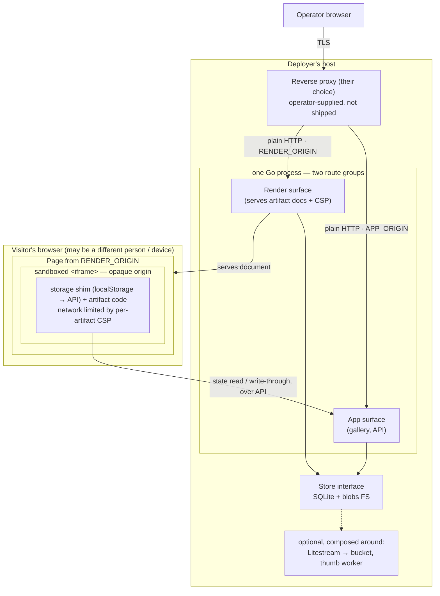
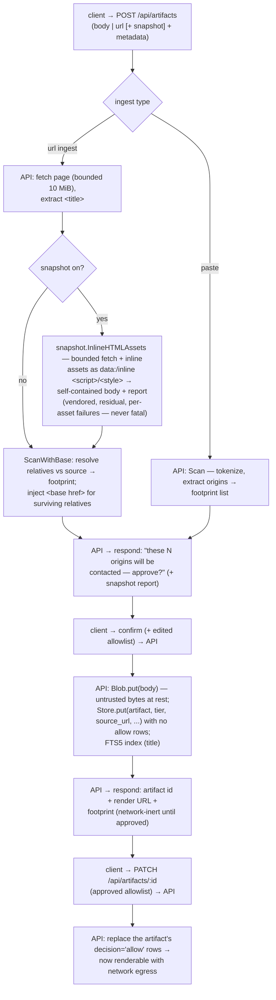
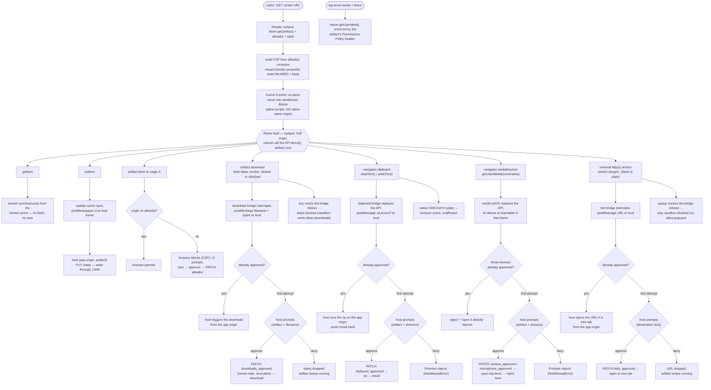

# Exhibit — Architecture

Companion to `product_requirement_doc.md` (the *what* and the boundaries) and
`technical_stack.md` (the *with what*). This document describes *how the
system is structured* — components, boundaries, data flow, and the request lifecycles
that matter. It assumes the decisions already made: Go service, single SQLite file,
blob store behind an interface, sandboxed-iframe renderer on a separate origin,
scan→allowlist→CSP network model, and the unconditional storage shim.

## 1. Architectural principles

Five rules shape every structural decision. When a choice is ambiguous, these decide it.

1. **It's just a file.** A tier-1/2 artifact is a self-contained document that runs in
   the *visitor's* browser. The service stores and serves it; it never executes artifact
   code. This is why the system stays small and why artifacts are durable.
   This is a critical part of the user's ownership of their software. They
   should be able to trivially take their software and data with them.
2. **One write path.** Every mutation — upload, paste, future extension, state
   write-through — enters through the HTTP API. Nothing writes the datastore directly.
   This is where auth, validation, and (later) replication and multi-user
   all attach.
3. **Two origins, hard boundary.** The app and the artifacts it renders live on
   different origins. The trust boundary between "our application" and "untrusted
   artifact code" is an origin boundary enforced by the browser, not a code convention.
   This is a core component of the artifact sandboxing.
4. **Observe, don't predict.** The system will not analyze an artifact ahead of time to
   _guess_ its behavior (storage use, network use). It installs interceptors and policy at
   the runtime boundary and observes what actually happens. Scanning functions may be
   done for heuristics, but never as a prescription for a contract.
5. **_DEPRECATED_** **Easy path and serious path share one system.** Single-user/local and
   replicated/multi-user are the *same* binary and schema with optional pieces composed
   around them. No forks, no rewrites — seams placed early (owner_id, Store interface,
   single write path) make the upgrades additive.
5. **Security should be simple, and by default.** The secure choice should be the default
   choice. And it should be secure by the nature of the design, not the details of the
   implementation.

## 2. System context


```mermaid
flowchart TB
    operator["Operator browser"]

    subgraph host["Deployer's host"]
        proxy["Reverse proxy (their choice)<br/>operator-supplied, not shipped"]
        subgraph goproc["one Go process — two route groups"]
            app["App surface<br/>(gallery, API)"]
            render["Render surface<br/>(serves artifact docs + CSP)"]
        end
        store["Store interface<br/>SQLite + blobs FS"]
        opt["optional, composed around:<br/>Litestream &rarr; bucket, thumb worker"]
    end

    operator -->|TLS| proxy
    proxy -->|"plain HTTP &middot; APP_ORIGIN"| app
    proxy -->|"plain HTTP &middot; RENDER_ORIGIN"| render
    app --> store
    render --> store
    store -.-> opt

    subgraph visitor["Visitor's browser (may be a different person / device)"]
        subgraph page["Page from RENDER_ORIGIN"]
            subgraph frame["sandboxed &lt;iframe&gt; — opaque origin"]
                artifact["storage shim (localStorage &rarr; API) + artifact code<br/>network limited by per-artifact CSP"]
            end
        end
    end

    render -->|serves document| page
    artifact -->|"state read / write-through, over API"| app
```

The same Go process answers both origins; they are route groups, not separate services.
The proxy that maps hostnames to the process and terminates TLS is the operator's, per
the tech-stack doc.

## 3. Components and responsibilities

### 3.1 API surface (the single write path)

The only way data changes. Route groups:

- `POST /api/artifacts` — ingest. Accepts a document body + metadata, **or a source
  URL** the service fetches once and stores as a file (the URL is persisted as
  `source_url`); runs the scan, returns the network footprint for approval, persists
  immediately (network-inert with `connect-src 'none'` until the allowlist is
  patched).
- `GET /api/artifacts`, `GET /api/artifacts/:id` — list/detail (drives the gallery).
- `PATCH /api/artifacts/:id` — edits: title, body (rewrites the stored blob),
  `network_allowlist` (the whole approved set, normalized to origins by
  `internal/origin` before it is stored — see below; the store translates it
  into `decision='allow'` rows and deliberately leaves any `decision='block'`
  rows alone, §3.3), `downloads_approved` / `clipboard_approved` /
  `links_approved` / `camera_approved` / `microphone_approved` (the per-artifact
  first-use capability approvals, §6 — the first three spent by a host bridge,
  the two device flags by the frame's gate and the render document's
  `Permissions-Policy`; named once in `store.ApprovalColumns` so the handler's
  strict-bool check and the store's cannot drift), and other
  scalar columns. Rewriting the body
  re-executes the scan and returns the footprint plus a `footprint_changed` flag so
  the edit dialog can re-run the explicit-approval gate when origins differ from the
  previous version; the allowlist is never seeded from that scan (spec §6.2).
  Tag and collection membership use the dedicated `POST/DELETE
  /api/artifacts/:id/tags/:tagID` and `.../collections/:colID` routes.
- `POST /api/artifacts/:id/refetch` — for URL-ingested artifacts, re-fetches
  `source_url` and replaces the stored body. A snapshot, not a versioned update.
- `DELETE /api/artifacts/:id` — deletes the artifact and associated rows (tags,
  collections, shares, state cascade via FK) **and its bytes**: the body blob,
  and the widget blob when it has one (av-7jcq). The order is row first, then
  bytes, because the two failure modes are not equally bad — a failed *row*
  delete after the bytes are gone leaves a live artifact whose only copy of
  itself no longer exists, which nothing on the instance can repair; a failed
  *blob* delete after the row is gone leaves unreferenced bytes, which breaks
  no row. The blob failure still surfaces as a 500 rather than a silent 204: a
  deletion that left the file on disk must not claim otherwise. What it no
  longer means is a permanent leak — the store queued those ids in the delete's
  own transaction (§3.3a), so the drain is retried until it succeeds.
  `DELETE /api/artifacts/:id/widget` removes the detached widget's blob the
  same way, in the same order — detaching is the only exit a widget blob has,
  since the id is otherwise reused for the artifact's life.
- `GET/PUT /api/artifacts/:id/state`, `DELETE /api/artifacts/:id/state[/:key]` — the
  artifact's state rows (§6). Reads are normally satisfied by render-time inlining, not
  this route; `PUT` is called by the **host frame** on the storage shim's behalf (the
  sandboxed iframe can't reach the API itself). The two `DELETE`s — one key, or all of
  an artifact's state — are the row-removal path the edit page's state inspector (§3.5)
  drives; they are idempotent (a key that was never stored is already absent) and `:key`
  is one percent-encoded path segment, since state keys are arbitrary artifact-chosen
  text. Erasing all state touches state alone: body, origin decisions, and capability
  approvals survive. All of them are authenticated like every other route here — the
  inspector adds no second write path. Every one is scoped to the session's own
  rows (av-q0ub): the session supplies both principals §3.3 describes, so a read
  never returns the union of every viewer's state and "erase all" means *mine*,
  not the artifact's.
- `GET /api/artifacts/:id/export` — the artifact as **one self-contained file**
  (av-vnkt), with every out-of-line asset folded back in as a `data:` URI. It is
  the enforcement point for the invariant those assets created: *the URL form is
  an internal storage and transport representation; the file is the canonical
  artifact, and it is materialized at every boundary where the artifact leaves
  the service.* A single file has nowhere else to put bytes, so `data:` and its
  ~1.33x are the price of the format — paid once, here, rather than on every
  render as the old inlining did. `internal/export` holds it as a package rather
  than a handler method because the static build (Exh-avau) is the other caller
  and must make the same decision the same way. A read of an asset that fails
  fails the whole export: better that than a file which claims to be portable
  while pointing at a URL that dies with the instance.
- `GET /api/artifacts/:id/assets`, `DELETE /api/artifacts/:id/assets/:assetID` —
  the artifact's out-of-line payloads (av-20fk), metadata only and never bytes.
  Read-and-delete by design: assets are produced by the ingest vendorer and by
  nothing else, so a create or update here would be a second way to put arbitrary
  content behind an artifact's render URL. The delete is the owner's escape hatch
  for the one case no rule decides — a payload whose feature they edited away.
- `GET/PUT/DELETE /api/artifacts/:id/widget` — the artifact's gallery-card widget
  (av-fafu). A second document stored beside the artifact's body and hung off the
  artifact rather than made a resource of its own, because it has no identity, no
  allowlist and no state apart from it. `PUT` scans the widget and reports which of
  its origins the *artifact's* allowlist doesn't cover — those are already blocked
  at render, so this explains a blank tile rather than gating one, and (as
  everywhere) never seeds the allowlist. See `widgets.md`.
- `POST /api/shares`, `DELETE /api/shares/:id` — share lifecycle.
- `DELETE /api/account` — erases the **caller's own** account and the library it
  owns (av-4wyq). It takes no id, from the path or the body, and that is the
  whole authorization argument: `/api/admin/users` is where acting on somebody
  else lives, behind `adminOnly`, and this route cannot name another account, so
  a session is sufficient for it. It requires a *session* specifically — the
  service token is not a person, and would resolve to the single-user default
  owner. The body must carry the typed confirmation phrase, checked here as well
  as in the page, because a client-side interlock is a courtesy to whoever is
  clicking and never a control. `Store.DeleteAccount` queues the blob ids whose
  rows it removed and the handler then deletes those bytes (§3.3a, av-7jcq); the
  instance's last enabled admin is refused (`ErrLastAdmin`).
- collection/tag CRUD.
- `GET /api/settings/public` — the instance's own name and description
  (av-4ac9). The one route in the `/api` namespace registered *outside* the
  authenticated group, because a visitor with no credential is exactly who
  needs it. The values are environment configuration carried on `api.Config`
  (`PUBLIC_MODE_ENABLED`, `PUBLIC_INSTANCE_NAME`,
  `PUBLIC_INSTANCE_DESCRIPTION`, `PUBLIC_OWNER_ID`) rather than a settings
  table, since the server-rendered gallery reads them on every page render and
  a table would buy nothing but a round trip. `PUBLIC_OWNER_ID` exists because
  owner scoping is a real predicate (below): an instance that publishes a
  library has to name whose. An instance with public mode off answers this
  route `404` — indistinguishable from one that never had it, and unambiguous
  for the caller, since 200-with-empty-strings already means "public, but
  unnamed".

**Allowlist entries are origins, validated here** (av-i7hd). `POST` and
`PATCH` both run `network_allowlist` through `origin.NormalizeOrigin`, which
reduces a value to scheme + host + explicit non-default port (lowercased, with
a trailing dot on the host stripped, and userinfo/path/query/fragment gone) and
de-duplicates the result. This is validation at the single write path rather
than a client convention, because the values are pasted straight into the
render CSP: a path-bearing entry is *path-matched* by CSP, so it would silently
mean something other than what the approval UI showed, and near-duplicate
spellings of one host would make "one decision per (artifact, origin)" (§3.3)
false in practice. A non-origin entry is a `400` naming the value rather than a
silent truncation to its host — truncating would grant a whole origin from an
entry the user approved as a single file.

Middleware chain (via `chi`): request logging → auth → owner scoping (`owner_id`)
→ handler. Auth accepts two credentials, in that order of preference: a session
cookie, when this instance has a login at all (§3.8), and otherwise the static
bearer token — the API/CLI credential, and the only credential a single-user
instance has. The owner is whatever the session resolved to, or `1`. Auth and
ownership are *one layer* every mutating route passes through, which is what
makes multi-user a middleware-and-data change rather than a rewrite.

**Public mode (av-wmp6)** is the one case where a request with no credential
gets past that layer, and it is deliberately narrow. When `PUBLIC_MODE_ENABLED`
is on, a request that resolved *no* credential may proceed if it is a `GET` of
`/api/artifacts` or `/api/artifacts/:id` — the published library and one
artifact in it — and nothing else. Every mutating method stays authenticated
whatever the configuration says, and so does every other read: `/state` is the
owner's data, `/transcripts` their conversations, and collections, tags,
shares, and the agent routes are never reached. The list is a deny-by-default
allowlist for the same reason the agent's is: a route added later must not
become public because nobody thought about it. Owner resolution follows in the
next middleware, which reads such a request as `PUBLIC_OWNER_ID` rather than
the default owner — since av-ep8k made owner a real predicate, "the library"
needs a named owner to mean anything. The pass is also recorded on the request
context, which is how a page render knows to suppress edit controls and to mint
render tokens that carry no principal (§3.2).

The owner the middleware supplies is a **real query predicate**, not a value the
store ignores (av-ep8k): handlers pass it into every Store method that names an
artifact, and those filter on it in SQL (§3.3). So the remaining step toward
multi-user is the middleware resolving a *different* owner — not an audit of
which queries forgot to scope.

### 3.2 Render surface

A read-only surface on `RENDER_ORIGIN` whose entire job is to emit an artifact as an
executable document with the correct security envelope:

- Looks up the artifact, pulls its body from the blob store, its approved origins
  (the artifact's `decision='allow'` rows, §3.3), and its current state.
- Generates the per-artifact CSP (`connect-src`/`script-src`/`worker-src`/`style-src`/
  `img-src`/`font-src`/`media-src` from the allowlist) and sets it as a response header
  on the document. `connect-src` is the allowlist alone — the storage shim needs no
  network of its own (§6). Every source in the policy sits in one of two buckets, and
  which bucket it belongs to is the only question a new directive raises: *network-
  reaching* sources are egress and stay allowlist-gated, while *local, no-egress*
  sources (`'unsafe-inline'`, `'unsafe-eval'`, `data:`, `blob:`) run bytes the artifact
  already carries or the visitor already picked locally and are therefore
  unconditional. That is the "it's just a file" thesis in policy form: `style-src`
  always carries `'unsafe-inline'` (inline `<style>` blocks and `style=""` attributes
  never need network approval), `img-src`/`font-src` always carry `data:` so an
  artifact that inlines its own images or fonts (`@font-face { src: url(data:…) }`)
  renders with zero network egress, `media-src` always carries `blob:` so a
  `<video>`/`<audio>` element can play back a file the artifact loaded locally via
  `<input type=file>` + `URL.createObjectURL`, and `script-src`/`worker-src` always
  carry `blob:`/`data:` so a script or Worker the artifact builds at runtime (the
  standard ffmpeg.wasm pattern) executes. One source is neither of those two buckets and is
  called out for it: an artifact's **own asset path** in `connect-src` (av-20fk)
  is a *system* source, added by the render surface and never by approval. Those
  are the same bytes that used to sit in the document as `data:` URIs and cost no
  approval; only the addressing changed, so the question the bucket rule actually
  asks — can the artifact reach content the user did not approve, or send
  anything to a third party — has the same answer either way. It is never written
  to `artifact_network_origins` and never appears in the allowlist editor, so a
  fully vendored wasm artifact keeps an empty footprint and there is no row a user
  can revoke to break their own artifact. Keeping that true took an explicit
  rule once av-oz40 began rewriting *markup* references into the body: the
  scanner then finds an `` on the render origin where a CDN used to
  be, and reported it as an origin to approve. The render origin is therefore
  dropped from every scan result before it becomes a footprint or an allowlist
  (`withoutRenderOrigin` in `internal/api/artifacts.go`, matched on canonical
  spelling rather than bytes, and applied at the write paths too so no client
  can send one in). Dropping it is not tidiness: an allow row for the render
  origin widens every directive from `RENDER_ORIGIN/a/<id>/assets/` to the
  whole origin — read access to every *other* artifact's render document and
  assets, arrived at by a user answering a question the UI should never have
  asked. `worker-src` is spelled out rather than
  left to fall back to `script-src` because its absence fails *silently* — the
  `Worker` constructor succeeds, nothing is logged, and the worker body simply never
  runs (av-x01o). Loading a script, worker, stylesheet, image, font, or media file
  *from a remote origin* still requires that origin on the allowlist — the network
  boundary is unchanged; only inlined/local, no-egress sources are permitted by
  default.
- Sets a per-artifact **`Permissions-Policy`** naming `camera` and
  `microphone`, built from the artifact's two device approvals (av-mv3k):
  `(self)` when approved, `()` when not. This is the one capability approval that
  is enforced on a *top-level* render rather than only bridged in the frame, and
  the reason is that a browser permission is granted per **origin** while every
  artifact shares one render origin — without it, a visitor who allowed the
  camera for one artifact opened directly has allowed it for every artifact on
  that origin, with no per-artifact decision in the loop. Permissions Policy is
  per *document*, so it splits that single origin grant back into one decision
  per artifact, enforced by the browser even when the origin's permission is
  already granted. Only those two features are named; every other
  Permissions-Policy feature keeps its default, so this header answers one
  question and does not become a second policy surface beside the CSP. A widget
  render is denied both devices whatever its artifact holds (§5.5's "strict
  subset", applied to a header).
- Injects the **render preamble** as the first `<head>` script(s) — the **storage
  shim** with the artifact's state **inlined** into it so `getItem` is correct
  synchronously, plus the download/clipboard/external-link **capability
  bridges**, the camera/microphone **capability gate**, the `data:` fetch
  **compatibility shim**, and the **out-of-line asset manifest** — then the
  artifact body. (Umbrella/family taxonomy: `security.md` §4.)
- The `data:` fetch shim (agaf-02xs) answers `fetch()` of a `data:` URL from a
  Response built in the frame rather than letting it reach the network service.
  WebKit refuses large `data:` fetches from an opaque-origin sandbox, so an
  artifact that loads a multi-megabyte payload that way never boots in Safari
  while working top-level. It grants nothing: a `data:` URL is inert content the
  frame already holds, and decoding it locally is strictly less work than the
  path it replaces. Framed-only, and **ordering-sensitive**: it must install
  before any artifact script, since a wrapper only shadows `fetch` for callers
  that run after it. It is one of two `fetch` wrappers the preamble installs —
  the asset manifest below is the other — and their order is now explicit rather
  than incidental: the manifest installs last and therefore wraps this one. What
  needs this shim is every `data:` fetch in the frame the manifest does not
  answer: one the artifact's own code performs, or one a future wrapper delegates.
- The **out-of-line asset manifest** (av-20fk) redirects the page's own `fetch`
  of each vendored payload to that artifact's asset route, matching on the
  *resolved* URL at call time so it survives minification and catches URLs the
  page assembles itself. It is injected here rather than stored in the body,
  which is what makes an agent's wholesale body rewrite unable to break asset
  loading, and what keeps `artifact_assets` the single source of truth. Widget
  renders get it too: the `WIDGET` narrowing exists to drop *authority* — the
  capability bridges — and resolving an artifact's own bytes grants none.
- Sets `Cache-Control: no-store` — the document is dynamic (inlined state + per-artifact
  CSP) and must never be served stale from a cache.
- Serves one out-of-line asset at `/a/:id/assets/:assetID` (av-20fk). This is the
  single exception to both rules above it: **no render token, and not `no-store`**.
  Both follow from the same fact — it serves immutable bytes and nothing else, no
  state and no policy — and they are linked, because a short-lived token in the URL
  would change it on every render and destroy exactly the cross-view caching that
  moving these payloads out of the body was for. The credential is the asset id:
  128 random bits, reachable only by someone who already knows the artifact id too,
  and looked up *under* that artifact so one artifact can never address another's
  bytes. It answers `Access-Control-Allow-Origin: *` (the sandbox's opaque origin
  sends `Origin: null`, which nothing else matches) with the payload's real
  `Content-Type`, and it **must never redirect** — the CSP source permitting it is
  path-scoped, and CSP drops path matching across a redirect.
- Is **gzip-compressed** when the client accepts it (av-f9b2). This is the surface where
  compression earns the most: `no-store` means there is no cache to amortise a render
  document across views, so every view pays its full size on the wire — and a snapshot
  that vendored a large runtime asset (§3.4a) can be tens of megabytes of base64. The
  trade is that compression is a per-request CPU cost here rather than a one-off, which
  is why the level is mid-range rather than maximal. `text/event-stream` is excluded
  from compression everywhere so the agent surface's SSE stream is never buffered.
- Is loaded by the app's pages as the `src` of a sandboxed iframe
  (`<iframe src="RENDER_ORIGIN/a/:id" sandbox="allow-scripts">`) with **no**
  `allow-same-origin`. Capabilities the opaque-origin sandbox denies — downloads
  (`allow-downloads` omitted) and `navigator.clipboard` read/write (Permissions
  Policy) — are not re-granted on the frame; they are proxied through the host
  frame by the render preamble's **capability bridges**, gated by per-artifact first-use
  approval (`downloads_approved` / `clipboard_approved`, §6). A prior
  `allow="clipboard-read; clipboard-write"` delegation was a no-op — Permissions
  Policy `allow=` keys on the frame's opaque src origin, which matches nothing —
  so it was removed. Native keyboard paste (Ctrl/Cmd+V) is a browser event and
  works regardless.

- Names in `frame-ancestors` who may embed the document: `APP_ORIGIN` always,
  and on a **share** the origins `EMBED_ORIGINS` configured (av-6nbo). Unset —
  every instance that has not asked — emits the byte-identical policy it always
  did. The widening is per *route*, not per artifact, and stops at `/s/:shareID`
  on purpose: that document carries no render token and therefore no principal,
  is already readable by anyone with the link, and is the only one whose point
  is to be seen off the gallery, while `/a/:id` and `/w/:id` inline a named
  viewer's state. So the two token-gated routes hand `serveDoc` no extra
  framers and the share route hands it the configured set — the decision is
  visible at the routes, and `buildCSP` holds no framing policy of its own.
  This header is also the *second* lock on that door rather than the first: the
  preamble's every `postMessage` targets `APP_ORIGIN`, so a foreign framer
  receives nothing from the shim and a share framed there cannot even write its
  state back; no cookie is ever set on this origin; and a share render holds no
  privileged control a stolen click could spend. Cheap to widen for shares, and
  for the same reason not worth turning on by default (`security.md` §1.8).

- Serves an artifact's **widget** at `/w/:id` (av-fafu) — the glanceable tile its
  gallery card renders. This is the same read path with the same CSP, built from
  the same allowlist, and the same state inlined; it differs only in which blob it
  reads and in taking the **narrowed preamble**: `WIDGET = true` short-circuits the
  state write-through, and the capability-bridge half of the preamble is not spliced
  in at all. So a widget's authority is a strict subset of its artifact's by
  construction, with no second policy to keep in sync — and a gallery page's worth
  of tiles doesn't ship a download bridge none of them can use. A widget render also
  gets a small base stylesheet (`margin:0; height:100%; background:transparent`),
  because a tile has no page of its own to establish a viewport. An artifact with no
  widget 404s here; its card renders the default tile instead (§3.5). See
  `widgets.md`.

- Requires a **signed render token** on `/a/:id` and `/w/:id` (av-c5aq): an
  HMAC-SHA256 credential scoped to one `(artifact, owner)` pair with a
  ten-minute TTL, minted by the app origin into every frame `src` it emits and
  verified here statelessly. It is how this surface acquires a principal — the
  answer to "whose state should be inlined" — without a session, which it
  deliberately cannot have: a top-level `/a/:id` is a real-origin document with
  the artifact's own script in it, so any cookie readable there is readable by
  the artifact. Links a visitor may click much later carry no token and go
  through the app origin's `/artifacts/:id/open`, which mints on redirect.
  `/s/:shareID` takes no token — the share row is the authorization (§7). Full
  rationale: `security.md` §1.3.

- Renders **for nobody** when the token says so (av-wmp6). A token carries an
  optional `anonymous` claim, and a document rendered under one inlines *no*
  state and installs a shim that writes none — the artifact boots empty and its
  storage dies with the frame. That is what a public instance's unauthenticated
  visitor gets: publishing a library must not publish what is inside the tools,
  or a run tracker's widget would put the owner's runs on the gallery grid
  without so much as a click. The claim is inside the MAC precisely because it
  *subtracts* authority — as a query parameter the viewer could drop it. Note
  the deliberate asymmetry with `/s/:shareID`, which still inlines the owner's
  state: a share is a decision its owner made about one artifact, where public
  mode flips a whole library with one environment variable.

The render surface never mutates anything. It reads (including state, to inline it), wraps,
and serves. This read-only property is what makes it safe to expose under the no-auth share
path (§7).

### 3.3 Store interface

The seam between handlers and persistence. Handlers speak only to this interface:

```
Store:  put/get/list/search artifacts, collections, tags, shares; get/put state;
        list/set/delete per-origin network decisions;
        users and sessions, including local credentials (§3.8),
        the admin mutations over them (§3.8a)
        and the per-owner entitlements they carry (§3.8c);
        the blob deletion queue (§3.3a)
Blob:   put/get/delete artifact bodies by id
```

`Blob.Delete` is **idempotent** by contract (av-7jcq): an id that was never
stored is success, not an error. That is the contract the object-store backend
this interface exists for already has — S3's `DeleteObject` answers success for
a missing key — so defining it the other way would make the S3 implementation
synthesize a failure with a `HEAD` before every delete, to honour a distinction
no caller wants. `FSStore` swallows `os.ErrNotExist` to conform; every other
error surfaces, because a delete that claims to have removed the bytes must
have.

**Owner scoping is in the queries** (av-ep8k). Every Store method that names an
artifact takes the requesting `owner_id` and filters on it in SQL — the
artifact-child tables (state, origin decisions, transcripts, shares, collection
and tag membership) through the same owner-scoped `EXISTS` subquery the tag
joins use. Ownership is therefore a property of the statement rather than a
handler-level pre-check a later caller can forget.

The contract those queries hold: **another owner's id is indistinguishable from
an id that does not exist.** A cross-tenant read returns what a missing row
returns; a cross-tenant write returns `ErrNotFound`, which handlers render as
404. Never a 403 — a permission error would confirm the row exists and make the
artifact routes a membership oracle over ids.

Exactly two accessors opt out, and are named to say so: `GetArtifactUnscoped`
and `GetShareUnscoped`. They serve the render surface, which has no session and
no owner in context, and the share path, which is owner-independent by design
because the share row *is* the authorization (§7). `grep Unscoped` is the whole
audit of the un-owner-scoped read surface — a test enforces that the call sites
stay inside `internal/render`, and closing the render gap with a signed token
carrying a principal is av-c5aq.

- **Metadata, collections, tags, shares, state** → SQLite (one file, WAL mode).
- **Artifact state** → `artifact_state`, keyed by `(artifact_id, user_id, key)`
  (av-q0ub). `user_id` is the **viewer**, deliberately not named `owner_id`,
  because on a shared artifact they are different people. So the four state
  methods take *two* principals and they answer different questions:
  `ownerID` authorizes reaching the artifact (the same owner-scoped `EXISTS`
  predicate every other artifact-child method uses), and `userID` selects whose
  rows. They hold the same value at every call site today and will not once a
  non-owner may open a shared artifact (av-7k7b), which is why they are two
  parameters — with `artifactID` between them, so transposing the two is a
  compile error rather than a cross-tenant read. Nothing is keyed by device:
  one user on any number of devices is one set of rows, which is the entire
  point of storing state server-side (§6). Two cascades retire a row — with its
  artifact (FK), and with its viewer (a trigger on `users` DELETE; a real FK
  would demand a `users` row for owner 1, which the static-token single-user
  mode does not have).
- **Network origin decisions** → `artifact_network_origins`, one row per
  (artifact, origin) — the primary key is what makes "one decision per origin" a
  schema invariant rather than a convention, and `ON DELETE CASCADE` retires the
  rows with the artifact. The primary key only delivers that invariant if the
  value in the row *is* an origin, so the store normalizes it too
  (`origin.NormalizeOrigin`, av-i7hd): the API's 400 is the user-facing rule and
  this is the same rule as a store invariant, closing it to any future caller.
  Rows written before that validation existed are repaired once by a Go
  migration (version 23) that normalizes them and collapses the resulting
  duplicates — keeping `block` over `allow` on a collision, so a repair can
  narrow a policy but never widen one, and dropping values with no origin in
  them at all. `decision='allow'` is the only input to the render CSP;
  `decision='block'` records a "don't ask again" answer for the runtime prompt
  (exhibit-fr7) and never widens the policy. A caller that knows only the
  allowlist replaces the allow rows without touching block rows, so a save from
  the edit page can never silently clear a decision it never displayed.
- **Search** → an FTS5 table over artifact title, the visible text of the
  artifact source, and tag names. `source_text`/`tags_text` are denormalized
  search shadows on `artifacts`, kept in sync by triggers and, for `source_text`,
  by the API writing it alongside the blob body — the blob store and the tags
  join remain the sources of truth (av-b6o9). `source_text` holds the body's
  *rendered* text (via `store.ExtractSearchText`: text nodes plus semantic
  attributes like `alt`/`placeholder`; markup, `<script>`, and `<style>` are
  dropped) so search matches what an artifact shows, not the code it's made of.
  A search box query is **literal text, never FTS5 syntax** (av-hic3): each
  whitespace-separated token is emitted as a quoted phrase with a trailing
  `*`, so prefix matching is preserved while `<script>`, `a:b`, or a stray
  quote search for themselves instead of failing the query.
- **Out-of-line assets** → `artifact_assets`, one row per vendored payload
  (av-20fk), with the bytes in the blob store. Content-addressed **per owner,
  never globally**: dedup inside a library is free, but sharing bytes across
  owners would let deleting one account strip a payload out of another's
  artifact unless the refcount were exactly right in every delete path forever.
  Deletability appeals only to what was recorded — the artifact went, a
  generation was superseded, or the owner asked — and **never** to whether the
  body still contains a matching `fetch` literal: the render manifest matches
  resolved URLs at call time, so a rewritten body can consume an asset whose
  literal is long gone. Enqueuing a blob for deletion is refcounted inside the
  removing transaction for the same reason sharing exists.
- **Bodies** → **filesystem or an S3-compatible bucket, selected by
  configuration** (av-52ll). Both implement the same three methods and nothing
  above the interface can tell which is behind it — that substitutability *is*
  the claim, and it is enforced by one contract test suite in `internal/blob`
  that both must pass, rather than by two sets of tests that happen to agree.
  `BLOB_S3_BUCKET` is the selector: unset is `FSStore` under `DATA_DIR`,
  byte-identical to before the bucket existed, so a self-hoster acquires no new
  required configuration. Set, `blob.S3Store` addresses the bucket over the
  MinIO SDK — S3-*compatible* rather than AWS, with the endpoint as
  configuration and no vendor feature, bucket layout or lifecycle rule assumed.
  The bucket is what a hosted instance needs and what a self-hosted one's backup
  story is missing: the Litestream profile streams the SQLite WAL and *only*
  that, so a restore from it recovers every row and none of the bytes those rows
  point at.

  Three properties are load-bearing and easy to lose.

  **The backend never buffers a whole blob.** A body that fits in one part is a
  single streamed PUT with a real `Content-Length`, a larger one of known length
  is read at offsets and allocates nothing, and only an unknown length has to be
  discovered by filling a buffer — bounded at the 5 MiB protocol minimum, so a
  vendored-wasm snapshot is never a per-request allocation the size of itself.
  Note the scope: this is a property of `internal/blob`, *not* of the service.
  Callers above the interface still materialise bodies whole — every read site
  is an `io.ReadAll` and every write site a `bytes.Reader` over a string already
  in hand — so a 16 MB snapshot does exist in memory during a render. Making
  *that* true end to end is a change at those call sites and a separate piece of
  work; what this buys is that the storage layer adds nothing on top of it.
  The subtlety worth knowing about is that the offset path addresses parts from
  zero and ignores the reader's position, so a *partially read* reader is
  reported as unknown-length rather than sized: the alternative uploads the
  object's first n bytes under the guise of its last n, at the right length and
  with no error anywhere.

  **A missing blob fails at `Get`, not mid-read.** The SDK's handle is lazy, and
  a caller that has already begun writing a 200 cannot go back and answer 404 —
  which is exactly what the render surface does with this error. `Get` therefore
  forces the request before returning, by reading one byte and putting it back
  in front of the stream rather than by calling the handle's `Stat`: `Stat`
  issues a *separate* HEAD, so it would make every blob read two round trips (a
  gallery of forty widget tiles, forty extra) and still leave a window in which
  an object deleted between the two failed mid-200.

  **`Delete` performs no existence check.** The idempotent contract on the
  interface exists precisely because `DeleteObject` already answers success for
  a key that was never there, so a `HEAD` in front of it would pay a round trip
  to manufacture a failure no caller wants.

  An artifact's **widget** (av-fafu) is a body too, so it lives here as a second blob
  with only its id (`artifacts.widget_blob_id`, empty for "no widget") on the row.
  The id is minted once and reused on every save, keeping the widget's render URL —
  which gallery cards embed — stable across edits.

- **Storage accounting** → `blob_sizes` (a blob's length) plus the
  `blob_references` view (which owner's rows name which blob), migration 021,
  av-fw1b. It is the first byte count anywhere in the schema: before it the only
  way to answer "how much is this owner holding" was to stat the blob directory,
  which knows nothing about owners and, on an object-store backend (av-52ll),
  is a paginated network crawl.

  Three decisions, in the order they matter.

  **A length is recorded where the bytes are written**, by the funnel every
  `Blob.Put` call goes through (`internal/api/blobwrite.go`, a counting reader
  around the write). Not by changing `Blob.Put`'s signature — that interface is
  the seam the object-store backend drops in behind, and a size out-parameter on
  it would be a thing every implementation has to get right for one caller's
  benefit. A test walks the package's AST and fails on a `Blob.Put` outside the
  funnel, because a missing length is invisible: it under-reports one owner
  until somebody runs a recompute they have no reason to run.

  **The total is derived, not counted.** An owner's bytes are the join of
  `blob_sizes` to `blob_references`, so there is no counter for a caller to
  forget to decrement — deleting an artifact stops its bytes being charged in
  the same statement that deletes it, and `DELETE /api/account` reaches zero by
  construction. The view is also the extension point, and av-20fk is the case it
  was built for: migration 026 replaced it with one that unions the asset
  references in — through `artifacts`, since `artifact_assets` has no owner of
  its own — and the usage query, the recompute pass, the backfill and the
  unreferenced-size prune all picked them up with no code change, because none
  of them knows what a reference is made of. That was not optional bookkeeping:
  a vendored payload is the largest thing the system stores, so leaving it out
  charged it to nobody, and — worse — the prune would have dropped the recorded
  length of a payload a second artifact in the same library still used.

  **A shared blob is charged at full size to every referencing owner**, and once
  to each of them (the readers take `DISTINCT blob_id` per owner — the charge is
  deduplicated *within* an owner and never *across* owners). Refcounted assets
  make this a real fork rather than a detail, and the alternative — dividing a
  blob's size among its referencing owners — was rejected on two grounds: it is
  gameable, since an owner could shrink their total by uploading what another
  tenant already has, and it is unstable, since one owner's number would move
  because a stranger deleted something. Full-size-per-owner is also simply what
  each of them would have to store alone. Crucially it is a property of the
  query rather than of whoever calls it: there is no way to ask for the other
  answer.

  **And it is correctable.** `RecomputeStorageUsage` re-measures every blob an
  owner references and rewrites the recorded lengths — idempotent, and the only
  accounting path that touches the blob store, which is why it is an operator
  command (`server storage recompute`) rather than anything on a request path.
  A blob it cannot read keeps the length it already had and is reported as
  unreadable, because treating an unreadable blob as zero would let one
  transient backend error silently shrink somebody's total. And it writes each
  length only if the row still says what it said before the measurement began:
  an edit landing in that gap has recorded the *new* body's length, and an
  unconditional write would replace it with the length of a body that no longer
  exists — a wrong number that would then persist, since nothing re-measures on
  its own. A repair pass never overwrites something fresher than itself.

  The same measurement, run for a different reason, is the upgrade path:
  `BackfillBlobSizes` runs at startup over blobs with no recorded length, so a
  library that predates migration 021 does not report `0 B` until every
  artifact happens to be edited. It is the shape `BackfillSourceText` already
  established for migration 010's gap — a startup pass, because the blob store
  is not reachable from SQL — and it is free on every start after the first.

  Nothing here refuses anything. The number is read by `/profile` and the CLI
  and by nothing that can say no; limits over it are av-10bw.
- **Condemned blob ids** → `pending_blob_deletions`, the deletion queue (§3.3a).

Because handlers never touch SQLite or the filesystem directly, swapping the metadata
engine (libSQL/Turso) is a backend implementation change behind a stable interface —
and the blob backend already is one.

### 3.3a Blob deletion queue (av-8gyd)

Rows and bytes live in two stores that cannot commit together, and the row has
to go first (above). That leaves a window in which a crash used to leak a file
permanently, with nothing able to name it afterwards. The fix is not to go
looking for strays later — the deleting code already knows which blobs it meant
to remove, so it writes that down:

- The transaction that removes an artifact, or detaches a widget, or erases an
  account also inserts those blob ids into `pending_blob_deletions`. One
  transaction, so the intent is recorded exactly when the last reference
  disappears — which is also the last moment anything could name them. "Those
  blob ids" includes an artifact's out-of-line assets (av-20fk), which is the
  one arm that is rows rather than columns and the one carrying most of the
  bytes: an account erasure that collected only bodies and widgets would leave
  every vendored payload on the volume with nothing left able to name it.
- **The enqueue is conditional on a refcount taken in that same transaction**:
  drop the row, count the rows still referencing that blob id, enqueue only on
  zero. Two artifacts in one library can legitimately share a blob, so an
  unconditional enqueue would strip the payload out of the survivor; doing the
  count inside the transaction is what makes the decision race-free. The count
  is one query (`internal/store/blobqueue.go`), which is the place a future
  blob-referencing table has to be added to.
- After the commit the caller deletes the files, then their queue rows, then
  the lengths recorded for the ids that actually went (av-fw1b) — the drain is
  the right place for that and the only one, since a blob reaches this queue
  precisely when the last row referencing it disappeared, so by then there is
  nobody left to charge. A crash anywhere leaves the queue rows in place, and
  `Blob.Delete` is idempotent for a missing id (av-7jcq), so repeating the work
  costs nothing and needs no compensating existence check.
- **The drain rechecks before it unlinks**, and an id that has acquired a
  reference again leaves the queue with its bytes untouched. A queued id says
  nothing referenced those bytes *when they were condemned*, which is a weaker
  claim than "nothing references them now": asset blob ids are content
  addresses, so re-ingesting the same payload names the very id sitting in the
  queue, and a drain that failed leaves its row for a startup that may be many
  ingests later. The recheck is the enqueue's own refcount, embedded in the
  `DELETE` of the queue row so check and retirement are one statement.
- **The recheck and the unlink are one critical section**, per blob id
  (`internal/store/bloblock.go`). A recheck is only true of the instant it
  ran, and the unlink happens outside SQLite, so without exclusion an ingest
  can write the bytes and commit a row naming them in the gap between the two
  — and the delete then lands on a payload something references. The ingest
  side holds the same id's lock from its first written byte to the commit of
  the referencing row, so whichever side wins, the loser sees a settled world:
  either a reference the recheck finds, or bytes it must write again. Only
  content-addressed ids can lose that race, since only they can be referenced
  again once condemned; a body or widget id is a fresh UUID and needs nothing.

What the commit makes durable is therefore the *intent*, not the outcome, and
everything after it is a retry of the same idempotent work — so there is no
state a crash can leave that a later drain cannot finish.

**When the drain runs.** Synchronously after a delete, for only the ids that
operation enqueued (bounded and fast, so no request ever walks a backlog), and
over the whole queue at startup, which is where crash leftovers are reclaimed —
a crashed process gets restarted, so the restart is the natural pairing. No
ticker, no worker pool, no scheduler; the queue is a plain table in the same
database because sharing a transaction with the row delete *is* the mechanism,
and an external queue would reintroduce the two-store atomicity problem one
layer up.

**No full scan, anywhere.** A reconciler that walks the blob store and infers
deletability from a missing reference is the wrong shape: a bug in the
inference deletes live artifacts, and its cost grows with the library. The
queue inverts both — it holds only ids something already decided to delete, so
a bug in the drain can reach nothing but condemned bytes, and it costs nothing
when idle because it is normally empty. Reclamation is automatic and invisible:
there is no operator command, and nothing to run by hand.

### 3.4 Ingest scanner

Invoked by `POST /api/artifacts`. Parses the document with a real HTML tokenizer
(`x/net/html`) to extract referenced origins (`src`/`href`/`action`/`<link>`/ESM
imports), plus a literal-URL heuristic over inline JS. Produces the deduplicated origin
list for the approval step. It is **transparency, not enforcement** — its output seeds
the approval step, never the allowlist directly; the CSP is the wall. For a URL ingest
the scan is **base-aware**: relative references are resolved against the source URL so
residual external origins still surface (a bare `Scan` drops relatives; `ScanWithBase`
resolves them).

### 3.4a Snapshot vendorer (URL ingest)

`internal/snapshot`, invoked by `POST /api/artifacts` when the request carries
`url` and `snapshot: true`. It runs **after fetch and before `Blob.put`** and turns a
fetched page into a self-contained file so the artifact honours the "it's just a file"
promise even after the source site rots:

- A single bounded **`Fetcher`** owns all fetch policy in one place — reference
  resolution against the source base, per-asset/total size caps, an asset-count cap,
  timeouts, a redirect limit, and a dial-time SSRF guard rejecting non-public addresses.
- **HTML inlining** walks the parsed tree and folds each fetchable reference into the
  document: ``/`<source>` (and `srcset`), icon `<link>`s → `data:` URIs;
  `<script src>` → inline `<script>`; `<link rel=stylesheet>` → inline `<style>`.
  Above `snapshot.InlineDataURIMaxBytes` the asset instead becomes an out-of-line
  blob and the reference is rewritten to its asset URL (av-oz40). It is a
  threshold rather than a rule because both directions have a real cost: inlining
  is paid at ~1.33x in every place the body travels, while externalizing a
  200-byte favicon buys a second HTTP request for nothing. Unlike the runtime
  pass this one *rewrites the document*, and must: an `` is not loaded
  through `window.fetch`, so there is nothing to intercept at render. That is
  safe here in a way it would not have been there — the URL *is* the reference,
  so an agent preserves it like any attribute, where the runtime pass's injected
  script could plausibly be dropped as noise.
- **CSS inlining** recurses through `url()` and `@import` chains (each sheet re-based
  against its own URL), inlining as `data:` URIs with cycle and depth guards.
- **Runtime-asset inlining** (av-ghvs) is a second pass over the markup-inlined
  document, for the binary payloads a page fetches from JavaScript — a wasm module,
  an Emscripten `.data` heap — which the markup walker by definition cannot see.
  Without it those artifacts do not run at all, and *the allowlist cannot fix them*:
  relocating a page to the render origin turns a fetch that was same-origin on the
  source site into a cross-origin one, and same-origin fetches never needed CORS
  headers, so source sites do not send them. The request is permitted by CSP; the
  **read** is what the browser refuses. Vendoring removes the request. The pass takes
  fetch-call literals from `<script>` text (via `scanner.FetchRefs`, the fetch half of
  `scanner.LiteralRefs` — one definition, so the vendorer's view cannot drift from the
  footprint's), keeps only binary-asset extensions
  (`.wasm`/`.data`/`.bin`/`.mem`) so it never speculatively GETs an endpoint that
  merely looks like a URL, and fetches through the same `Fetcher` under its own larger
  per-asset cap (`MaxInlineAssetBytes`) — these payloads are a tool's reason to exist,
  where an over-cap image only degrades a page that still works. ESM import refs are
  deliberately left alone: native module loading never consults `window.fetch`, so a
  vendored copy could never be served to the module loader — those origins belong to
  the `script-src` allowlist, where the footprint reports them.
  The pass **collects; it does not transform** (av-20fk). Each payload becomes a
  blob of its own, recorded in `artifact_assets`, and the stored body keeps the
  fetch literals it was ingested with — there is no ingest-time body transform at
  all. Substitution moved to render time (§3.2), and two properties follow that
  are the reason for it: an agent rewriting the whole document — the normal
  operation in the preview loop — cannot break asset loading, because there is
  nothing in the body to break; and the assets table is the single source of
  truth rather than being copied into every stored body as ~1.33x base64.
  The alternative had put a 16 MiB payload into the agent's context as ~21 MB on
  every read *and* every write, made the edit page slow, and — since the render
  document is necessarily `no-store` — re-transferred it on every single view.
  Substitution remains by **interception, not source rewriting**, wherever it
  happens: a runtime-constructed URL is served only when that same absolute URL
  also appears as a literal fetch ref somewhere in the page, since assets come
  from literals alone. Note the direction of that limit — it constrains what is
  *collected*, not what is *consumed*, which is why a vanished literal can never
  authorise deleting an asset (§3.3). Because the page's original literal is left
  in place, the scan still reports that origin; over-reporting fails safe (it asks
  about an origin no longer contacted rather than staying silent about one that is).
- **Partial failure is data, not an error.** Any reference that can't be inlined (404,
  over a limit, blocked address, runtime-constructed URL) keeps its original value and
  is recorded as a typed `FetchError`; the rest of the page is still vendored. The
  handler assembles these into the response's `snapshot` report (vendored URLs/bytes,
  residual origins, per-asset failures) so the user always gets a usable artifact. An
  over-cap runtime asset is the case this matters most for: the artifact is stored and
  the reason is reported, instead of the user meeting a bare `TypeError` at render with
  only an allowlist that cannot help.
- **Fallback (`<base href>`).** Whether snapshot is off, failed, or left residual
  relatives, a URL ingest injects `<base href="<source-url>">` at the top of `<head>`
  so surviving relative references resolve against the source site rather than the
  render origin. This is transform-independent option A; the CSP allowlist still governs
  whether those origins are *reachable*.

The vendorer never seeds the allowlist — residual origins go through the same explicit
approval as any other footprint (spec §6.2).

### 3.5 Gallery (web UI)

Server-rendered pages built with the stdlib `html/template`: the templates live in
`internal/api/templates/` (committed source, `go:embed`-ed), their handlers and view
models in `internal/api/gallery.go`. Each page's stylesheet and script are static
assets authored in the `web/gallery/` workspace and served under `/assets/gallery/`;
per-request values (the page's API credential, artifact id, allowlist, capability
approvals) reach the page scripts through a small inline bootstrap `<script>` the
templates render, with html/template's contextual escaping JSON-encoding them.
Talks to the API like any other client — with the credential the *request* earned,
never the process's: a session-authenticated browser is handed no token at all
(its cookie already authenticates it, and an embedded token would outlive the
logout that deletes the session), an anonymous visitor none plus a read-only flag,
and only an instance with no identity provider embeds the static token it has
always embedded. `pagecredential.go` decides that once and `web/gallery/api.js`
spends it; `security.md` §1.5 is the full statement.

The pages also render library data *server-side*, so each needs the second half
of what the API group's chain supplies: whose library this is. The page routes
therefore sit in their own group under `ownerMiddleware` (av-syug), and the
owner reaches them from `sessionGate` — the same lookup that marks a request
session-authenticated for the credential decision above now also carries the
session's `owner_id` in the request context, where `ownerIDFromCtx`, every
scoped `Store` call and every minted render token read it. `ownerMiddleware`
never overwrites an owner resolved upstream, so it composes with the gate
without an ordering rule while still supplying the single-user default on an
instance that issues no sessions. Membership of that group is the declaration
that a route is owner-scoped: a page registered outside it resolves to no owner
and reads an empty library, which is the deliberate fail-closed answer
(`security.md` §1.6) and what `pageowner_test.go`'s route walk enforces.

Hosts two islands of client JS: the **CodeMirror** source
editor (an esbuild-built, `go:embed`-served bundle) and the **renderer iframe**
(which actually points at `RENDER_ORIGIN`). The gallery renders server-side,
but search filters eagerly from the client: a debounced input refetches the
same server-rendered gallery with the query and swaps only the grid, so the
FTS5 search query stays authoritative without a full page reload. Filter,
tag/collection management, and the allowlist editor are full-page server renders.

**The detail page never embeds the artifact's source** (agaf-02xs). The code
lives one click away on the edit page, in CodeMirror, which is the surface built
for reading it; the detail page is the *running* artifact. That is a size
invariant, not a preference: the page's weight must stay independent of the
artifact's. A `<pre>` of the body made the page as large as the artifact plus the
iframe that also loads it — 16.7 MB for a snapshot with a vendored wasm — and
Safari simply stalls on a response that size, so the navigation never completes
and the artifact "never loads". Chromium survives it, but under real memory
pressure the same weight amplifies into a multi-gigabyte runaway. The rule for
any future panel here: the detail page may show *facts about* an artifact, never
the artifact's bytes.

The edit page carries one further island, the **state inspector** (av-hg5f): a
collapsible panel beside the security panel that reads the artifact's state rows
and renders each value through a control inferred from its shape — text, number,
boolean, ordered list, uniform-record repeater, labelled object fields — with a
read-only pretty-print for values no control fits. It deliberately offers no
raw-text/JSON editing of a value: a hand-typed blob is the corruption the panel
exists to undo. Its shell renders server-side and its contents are fetched on
first open (state is cold data the rest of the page never needs); edits apply
through the same authenticated state routes (§3.1) on Save, so Cancel simply
rebuilds the working copy from what the server last confirmed.

Where state changes *after* load and a full reload would cost too much — it
would drop a live iframe, an editor buffer, or an SSE stream — the page swaps
in a **server-rendered fragment** instead, driven by **htmx** (vendored from
`web/htmx/`, served from the app origin at `/assets/htmx/htmx.min.js`, never a
CDN). Fragment routes live under `/partials/*` beside the page routes rather
than in the API group: they render the same named template partial the full
page render used — the point is that each component has exactly one definition
— and carry no authority their page doesn't already have. The first consumer
is the agent surface's preview pane (§3.7); the wiring (trigger, target, swap)
sits in the markup, so page JS only dispatches the event that says "something
changed". `/partials/card-widget` is the second: the edit page's widget panel
swaps it after a save, refreshing the tile without a reload that would drop
the CodeMirror buffer beside it.

**Card widgets (av-fafu).** Each card leads with a tile: either the artifact's
widget in a sandboxed frame from `RENDER_ORIGIN/w/:id`, or — when it has none —
a **server-rendered default tile**, a monogram on a tint derived from the
artifact id. The default is deliberately markup rather than a frame or a
thumbnail: no-widget is the common case, and a gallery of forty cards must not
pay forty frame loads (or a screenshot pipeline) to say "nothing to show". The
widget frame is `pointer-events: none` and `tabindex="-1"`, so a click reaches
the card beneath and opens the artifact — "informative, not interactive" is a
consequence of the layout rather than something event handlers must enforce.
Both states come from one `cardWidget` partial, shared by the gallery card, the
edit page's preview, the agent preview pane, and the fragment route. See
`widgets.md`.

Ingest has its own page, `GET /new` (`new.tmpl`), rather than a form stacked on
top of the library index (av-qo0j). It presents the three routes in as peers —
Paste HTML and From URL, the two modes of one ingest panel, plus a link to the
agent surface (§3.7) — and the index keeps a primary "Add artifact" button
pointing at it. The page holds no server state of its own: it posts to
`POST /api/artifacts` like any other API client, walks the user through the
footprint approval, PATCHes the approved allowlist, and hands off to the new
artifact's detail page. The snapshot toggle is URL-mode-only, because the
vendorer (§3.4a) needs an absolute base URL to resolve a page's references
against.

`notfound.tmpl` answers every app-origin HTML 404 — an unrouted
path (registered as the mux's `NotFound` handler) and a missing artifact on the
detail or edit route alike — so the two arrive at the same page rather than at
two different bare `http.Error` strings. It echoes the requested path back as a
template value (contextually escaped, since that text is attacker-controlled),
and offers the gallery link plus a plain GET form the index already answers via
`?q=`. `/api/*` is excluded by path prefix: chi copies the not-found handler
into every subrouter, and those routes keep the plain error their JSON clients
already expect.

### 3.6 Optional satellites (composed around, not shipped in)

- **Litestream** sidecar → streams the SQLite WAL to a bucket; supervises restore on
  empty volume.
- **Thumbnail worker** → headless Chromium screenshotting artifacts, kept out of the main
  image.
- **Future Chrome extension** → another API client for chat-UI ingest.

### 3.7 Agent sidecar (Pi harness, Exh-yvhp)

The build/modify-with-AI surface follows the same satellite philosophy but is
spawned by the service rather than composed by the operator: each chat session
runs one `pi --mode rpc` subprocess (Pi, Mario Zechner's agent harness —
JSONL over stdin/stdout), managed by `internal/agent`. If the `pi` binary is
absent the surface degrades to disabled; nothing else changes.

- **Single write path preserved:** the sidecar is loaded with built-in tools
  disabled and exactly one extension (`internal/agent/ext/exhibit.ts`) whose
  `create_artifact` / `update_artifact` / `get_artifact` tools, plus
  `get_state` / `set_state` / `delete_state` for the artifact's stored state
  (av-lvi1) and `set_widget` / `get_widget` for the artifact's gallery-card
  widget (av-fafu), call back into the exhibit HTTP API — the same routes and
  Store methods the edit page's state inspector (§3.5) uses. Agent output is
  scanned like any ingest and its footprint is never auto-approved.
- **Scoped credential, not the service token (av-e0yj):** each session
  authenticates with a token minted by `internal/agentscope` that resolves to
  (owner, artifact). `authMiddleware` refuses anything outside that scope with
  a 403 before a handler runs — a deny-by-default allowlist of
  `POST /api/artifacts` while unbound, plus `GET`/`PATCH` on the session's own
  artifact and the `state`/`widget` sub-resources its own tools call on that
  same artifact. A create binds the credential to the id the handler just
  wrote, so the binding is not something model output can shape. None of the
  tools takes an artifact id.

  The scope composes with — it does not replace — the owner scoping of
  av-ep8k. The grant's owner becomes the request's `ownerID`, so every
  owner-scoped Store call is bounded by it exactly as for a browser client;
  the path check then narrows that owner's library to one artifact. Neither
  half is sufficient alone: without the owner the session would be confined
  to an id that could belong to anyone, and without the path check it would
  hold ordinary full authority over its owner's whole library.
- **The session itself belongs to an owner too.** Sessions live in an
  in-memory registry rather than in SQLite, so they were the one piece of
  per-owner state av-ep8k's query sweep could not reach: `Manager.Get` took an
  id, and the four routes that resolve a session by it — `prompt`, `abort`,
  `events`, and the `DELETE` that closes one — compared nothing, so any
  authenticated user holding a session id could drive somebody else's agent.
  The lookup now takes the owner as a *parameter* (`Manager.Get(ownerID, id)`),
  for exactly the reason av-ep8k put the predicate inside the SQL rather than
  in front of it: a check the caller performs is a check the next caller
  forgets. Another owner's session is *not found* rather than refused — 404,
  never 403, the same answer an id that was never issued gets (§3.3) — so the
  routes are not an oracle over which sessions are live. The SSE route resolves
  its own owner in `authorizeEventStream`, because `EventSource` sets no
  headers and the route therefore sits outside the middleware pair; it returns
  the owner those middlewares would have supplied and puts it on the request
  context, so there is still one owner check for all four routes rather than
  two that must be kept in step. What this closes is worse than a read: a
  prompt sent to a stranger's session runs its tool calls on *that session's*
  credential, so the injected instruction lands in the victim's artifact —
  av-e0yj's containment defeated rather than evaded.
- **Untrusted text stays out of the system role:** the artifact's source and
  title reach the model in a user-role message inside a nonce-fenced data
  block, never interpolated into the system prompt. The source is inlined at
  session start, so a modify session spends no tool call on the first read.
- **BYO key, sealed at rest:** the user's provider key is stored AES-256-GCM
  encrypted under a server secret (`internal/secrets`, `agent_keys` table) and
  handed to the subprocess only through its (minimal, built-from-scratch)
  environment. Reads return masked hints; page JS never sees the key again.
- **Or the instance's own key (av-siqf).** `AGENT_API_KEY` puts the instance
  in *platform mode*: `agentSessionOpts` — already the single place a key is
  resolved, and therefore the only place this appears — returns the platform
  credential without consulting `agent_keys` at all, so an owner's stored key
  is neither read nor deleted and unsetting the variable restores it intact.
  One variable chooses between two modes rather than a per-owner key
  overriding an instance-wide fallback, which would silently mix billing
  models and still leave a key field on a surface whose point is that nobody
  needs one. In this mode nothing reports the credential *or what it is*: the
  key route `404`s, and the page renders no key control, no provider select
  and no model input. That last part is a claim about Pi's protocol rather
  than about a handler — every assistant message Pi emits carries
  `api`/`provider`/`model`, and both seams that publish it (the SSE broadcast
  and the persisted transcript) are verbatim passthroughs — so platform mode
  strips those three fields from Pi's message envelopes at both
  (`internal/agent/redact.go`), keeping the `usage` block beside them, which
  names no model and is what metering will read. Availability stays a
  separate signal: no `pi` binary is still a 503 in either mode. **No spend
  cap exists** — nothing reads token usage off the stream — so this belongs
  on a controlled instance until av-hyo6 lands; the startup log says so.
- **Streaming:** the service fans Pi's event stream out to the browser via
  SSE (`/api/agent/sessions/:id/events`); prompts arriving mid-run become Pi
  steering messages. Transcripts are persisted per artifact
  (`agent_transcripts`) as colophon-style provenance for future remixing.
- **Stream auth is a ticket, not the token (av-rgp1):** this is the one route
  a browser cannot send an `Authorization` header on, because `EventSource`
  has no way to set one. It therefore takes a **session SSE ticket** in the
  query string — random, bound to one session, single-use, seconds-lived,
  and minted only by an ordinary header-authenticated request (session
  create, widget generate, or `POST …/sessions/:id/ticket` for reconnects).
  The service token never appears in a URL, so it cannot be copied into this
  service's debug request log, the operator's proxy access log, or browser
  history; a recovered ticket buys at most a brief window to *open* one
  connection to one session's event stream, never the library. The TTL bounds
  when a new connection can be established with that ticket — it is not a
  deadline on a connection already open, which the ticket check never revisits
  once redeemed. Redeeming the ticket also
  establishes the stream's owner, so the owner check that guards every other
  session route (`Session.OwnerID` vs the request's owner) applies here as
  well — a session id alone is not a capability.
- **Live preview:** a successful save tool call emits the synthetic
  `exhibit_artifact_saved` event, which the chat page turns into an htmx
  fragment swap of the preview pane (§3.5): `GET /partials/agent-preview`
  re-renders the pane's own template partial, iframe included, with a fresh
  cache-busting stamp on the render URL. The pane therefore has one definition
  for both the initial render and every re-render, and the swap costs neither
  the transcript nor the SSE stream a reload would.
- **Widgets (av-fafu):** the system prompt carries the widget contract and the
  agent builds one by default, so a tool and its gallery tile are authored
  together. `set_widget` emits a distinct `exhibit_widget_saved` event rather
  than reusing the artifact one — the live preview did not change, only the
  tile beside it — and the pane's re-render brings that tile in. The pane shows
  the tile precisely so the default tile is visible too: that is what "this
  artifact has no widget yet" looks like.
- **Agent as a function (av-fafu):** the edit page's "Generate widget" button
  runs a *one-shot* session — `POST /api/artifacts/:id/widget/generate` creates
  a `WidgetOnly` session, sends one fixed server-side prompt, and returns the
  session id without waiting. The caller watches the same SSE route the chat
  uses for `exhibit_widget_saved`, so a non-chat agent surface costs a route
  and no second streaming path. The request deliberately does not block on the
  turn: holding it open would make a slow model indistinguishable from a hang.
- **Trust note:** the sidecar is a subprocess of the service executing
  LLM-directed tool calls, and unlike every other API client it is steered by
  text the service did not author — artifact bodies and titles arrive verbatim
  from URL ingest. Its reach is therefore deliberately *narrower* than a normal
  client's: read and rewrite one artifact — its source, its state, its widget —
  and nothing else in the library. It holds no datastore
  access of its own and no credential that outlives its process. What that does
  not buy: injected content can still write a bad body into the artifact the
  user opened — bounded, visible in the preview and transcript, and stated
  plainly in `security.md` §5.3.

See `docs/agent.md` for the full flow, including snippet mode (the render
surface's element picker that feeds an element screenshot + descriptor back
into the prompt as multimodal context).

### 3.8 Login: two paths, one session layer (av-30rj, av-q30x, av-rzvf)

Login is optional. When present it arrives by one of two paths — an identity
provider, or a local login name and password — and both end in the same call.

**The provider seam.** `internal/auth` holds the whole vendor surface, and it is
two methods:

```go
type IdentityProvider interface {
    AuthURL(state, verifier string) string
    Exchange(ctx context.Context, code, verifier string) (*Identity, error)
}
type Identity struct{ ExternalID, Email string }
```

It is that small because **the provider is a login-time concern only**. The
browser goes to the provider, comes back to `/auth/callback` with a code, and
that code is exchanged exactly once for a session this service owns. From then
on a request is authenticated by looking up its own session row — no provider
call on the request path, and no provider-specific value anywhere downstream.

The alternative shape — verifying a provider-signed token on every request —
is the API-token pattern and is wrong here twice over: it puts a network check
in the request path, and it makes logout impossible, because a signed token
stays valid until its TTL whatever the user or the provider later decides.
Owning the session fixes both, which is why Grafana, Gitea, Outline and Immich
all land in the same place.

- **The generic provider is the only one shipped.** `auth.OIDCProvider` does
  Authorization Code + PKCE against any issuer, discovering endpoints and keys
  from `/.well-known/openid-configuration` — discovery is what makes "any OIDC
  provider" a matter of configuration rather than of code. Libraries are
  `coreos/go-oidc/v3` + `golang.org/x/oauth2`, both generic; no vendor SDK
  appears in `go.mod`. A second provider is a constructor and a
  `var _ IdentityProvider` assertion, nothing else.
- **Session:** an opaque random id in an `HttpOnly`, `SameSite=Lax`,
  app-origin-only cookie, looked up per request against `sessions`. Never on
  `RENDER_ORIGIN`: a top-level `/a/:id` is a real-origin document running the
  artifact's own script, so a cookie readable there is readable by the artifact.
  `Secure` follows `APP_ORIGIN`'s scheme, since a `Secure` cookie on a
  plain-HTTP instance is silently dropped and makes login impossible.
  `SameSite=Lax` is the CSRF control for every mutating route, and it holds only
  while no GET route mutates — `security.md` §1.4 states the posture and
  `internal/api/csrf_test.go` pins both halves of it.
- **Schema:** `users(id, external_id, email, created_at, password_hash,
  is_admin)` and `sessions(id, user_id, expires_at)`. `users.id` *is*
  `owner_id` — no table outside `users` references a provider-specific
  identifier, so changing provider is a re-link of those rows rather than a
  migration. `email` is stored beside the subject precisely because subjects
  are provider-specific and are the wrong key to re-link on. `password_hash`
  is **nullable**, which is what puts both kinds of user in one table and one
  owner id space: an identity a provider issued has none, a local account has
  one, and they differ by which columns are populated rather than by living
  apart. Two tables would have made "the same person has an SSO login and a
  local one" an account-linking problem in the schema, before anyone had
  decided it was a problem worth having.
- **Default is unchanged.** With neither login configured there is no provider
  and no credential, the `/auth/*` routes are never registered, the page gate is
  a pass-through, and the static token with `owner_id` 1 behaves exactly as it
  always has. An operator who would rather authenticate at their reverse proxy
  (Authelia, Tailscale, basic auth) does so with nothing configured here —
  consistent with TLS and proxying already being theirs (`deployment.md` §3).

**The local credential (av-q30x, av-rzvf)** is the second path, and the one
that closes the gap the seam above left open: with no OIDC issuer configured
there was no page gate *at all*, so securing a self-hosted library meant
running an identity server or putting auth in the proxy. It began as one
credential in the environment; av-rzvf moved the accounts into `users` so an
instance can issue as many as it likes without one.

- **It is not an `IdentityProvider`, and must not become one.** That interface
  is redirect-based: an external authority to send the browser to, and a code to
  redeem. A form post has neither, and forcing it through would mean inventing a
  self-redirect and a fake authorization code that exist only to satisfy a
  shape. So the structure is one *session layer* with two *login paths*, which
  is what "one session layer, not two" actually asked for.
- **The convergence point is `startSession`** (`internal/api/auth.go`), the only
  place a session is ever created. Both paths reach it holding a resolved
  `*store.User`; everything after it — the `sessions` row, the cookie,
  `owner_id` — is identical and cannot tell them apart. The login method is
  recorded in a log line and nowhere else.
- **Credentials are bcrypt hashes, never plaintext the service hashes for
  itself.** Accounts are provisioned by an admin (the account screen in §3.8a,
  or `user add` / `user passwd` at the CLI), so there is no
  self-registration to verify and no reset mail, and therefore no SMTP — the
  costs that made passwords a bad trade for a multi-user product (av-30rj) are
  the ones this shape does not pay. A local account's `users.external_id` is
  `local:<normalized name>`, which reuses that column's existing UNIQUE
  constraint to make "one account per login name" a schema invariant, without
  constraining `email`, whose value on an OIDC row is whatever the provider last
  reported.
- **The first user on an instance is its admin**, applied inside the single
  `INSERT` that creates every `users` row (`store.insertUser`, `is_admin =
  NOT EXISTS (SELECT 1 FROM users)`). One statement rather than a count
  followed by a write, because the gap between those two is exactly what
  decides who administers the instance. It is also continuous rather than new:
  user ids start at 1, the id a single-user library is already filed under, so
  the first identity in has always adopted the existing library — which is why
  `deployment.md` §3.4 tells operators to be first.
- **`LOGIN_USERNAME` / `LOGIN_PASSWORD_HASH` are retained as bootstrap and
  break-glass**, not replaced. The pair names an account and supplies an
  additional accepted password for it: on an empty instance that creates the
  first admin, on a populated one it is the way back into an account whose
  password is lost. `resolveLocalLogin` checks it *before* the table so no
  stored state can shadow it, and falls through to the table when it does not
  match, so a password reset takes effect without a restart. It stays live for
  as long as it is set — the reasoning for that, and the bypass it costs, is
  recorded on `newLocalCredential` in `cmd/server/main.go`.
- **Routes.** `/auth/login` renders the login page when a local login exists
  and otherwise redirects straight to the provider — a page whose only control
  is "continue" is a choice that does not exist. `POST /auth/local` is the form
  target; `/auth/sso` is the provider redirect, split out so the page has a
  button to point at when both paths exist. Each is registered only when the
  instance can serve it, which is why "does this instance have local accounts?"
  is read once at startup (`Config.LocalUsers`) rather than per request:
  provisioning the *first* account with the CLI on a running server takes a
  restart to arm the gate.

### 3.8a Administration: one boundary, drawn on the route (av-utap)

Once Exhibit issues credentials it *is* the user directory, so it has to answer
"who creates accounts and resets forgotten passwords". Two surfaces sit on the
same `users` rows and must not be confused:

- **A person acting on their own account** (av-g2dx) — a session is the whole
  authorization.
- **An admin acting on the instance** (here) — creating someone else's account,
  resetting someone else's password, switching an account off. A session is
  emphatically *not* sufficient.

They will share page furniture (the settings shell, the stylesheet, the header
partial). The guarantee is that they never share authority, and it is
structural: every route that reaches another account passes `adminOnly`
(`internal/api/admin.go`), and none of them shares a handler with a route that
does not.

- **The guard answers `404`, not `403`,** and answers it *before* any handler
  looks at the target. Two things fall out of that. To a non-admin the
  administration surface does not exist. And a refusal cannot differ between
  "you may not touch user 7" and "there is no user 7" — an admin acting on a
  missing id gets the same 404 — so the refusal is not an enumeration oracle
  over the instance's directory.
- **Who is an admin,** in the order it is decided: never an agent-session
  credential (steered by text Exhibit did not author) and never an anonymous
  public visitor; yes for the static service token, which already carries full
  authority over every API route; yes for a session whose account is an
  *enabled* admin, looked up per request so a demotion takes effect on the next
  one; and otherwise only on an instance with no login configured, which has one
  user and no notion of anybody else to be.
- **Disabling is a column, and revoking sessions is part of it.** Clearing
  `password_hash` was the alternative and does not generalise: an identity a
  provider issued has none to clear, and it is a first-class row in the same
  table. So `users.disabled_at` is nullable, applies to both kinds of account,
  and destroys nothing an admin may later want to restore. Refusing the next
  login is only half of it — the credential a disabled person is actually
  holding is the session already in their browser — so `Store.SetUserDisabled`
  deletes that user's `sessions` rows in the same transaction rather than
  leaving it to whichever caller remembers; the API and the CLI both inherit
  that. Login is then refused on every path, including the `LOGIN_USERNAME`
  break-glass pair: a disable a documented environment variable defeats is not
  a disable.
- **The instance cannot be locked out of itself.** Demoting or disabling the
  last *enabled* admin is refused (`store.ErrLastAdmin`). The guard is a
  predicate inside the `UPDATE`'s `WHERE` rather than a read the caller makes
  first, for the same reason the first-admin rule lives inside its `INSERT`:
  the gap between a check and a write is exactly what decides who can still
  administer the instance. A disabled admin does not satisfy the predicate, so
  the lockout cannot be reached in two individually-legal steps either.
- **Not the login endpoint.** An admin setting a password *asserts* a
  credential; `/auth/local` *guesses* one. Only the guess is rate-limited
  (av-t21v), so an admin resetting several accounts in a row does not throttle
  themselves out of their own instance.
- **Routes.** `GET /admin/users` is the page — registered inside the page group,
  so it carries an owner like every other page, *and* behind `adminOnly`,
  because carrying an owner is not carrying authority. `GET`/`POST
  /api/admin/users` and `PATCH /api/admin/users/{id}` are the JSON API its
  controls call: the single write path (§3.1) is why the page has no form
  handler of its own. The `PATCH` also carries the per-owner entitlement
  (§3.8c), and `GET` takes `?entitlement=custom` — the drift list.

### 3.8b Your own account: `/profile` (av-qo05)

§3.8a's other half, and the pairing is what makes the boundary legible. The two
pages read the same `users` rows and wear the same furniture — the settings
shell, `settings.css`, the `settingsHeader` partial — and share no authority:
`/admin/users` reaches *other* accounts and passes `adminOnly`, while `/profile`
reaches exactly one, resolved from `ownerIDFromCtx` and never from the URL, so a
session is the whole authorization. The route takes no id, which is why there is
no second guard here to get wrong.

- **The entry point is two icon-only header controls.** "Add artifact" shrank
  from a labelled primary button to a square linking to `/new`, and a static
  person icon beside it links here. Same box, same weight: the gallery header's
  subject is the library below it, and a wide primary button made the header the
  loudest thing on a page it is not about. Both carry an `aria-label` and a
  `title`, since a glyph states nothing on its own; the admin link keeps its
  label, because a third anonymous icon would say nothing at all. Static means
  static — an anchor, no menu. What belongs on the page (deletion, the agent
  key, sessions) each needs explanation or a confirmation beside it, and none of
  that fits a menu item.
- **Sections from the first one.** The page is `.card` blocks, though only
  Account has content today, because the rest of av-g2dx — the BYO agent key,
  active sessions, export — should land as an addition rather than a redesign.
- **The display name has a fallback `admin.go` does not need.**
  `newAdminUserView` is `Name: u.Email`, and `users.email` is NOT NULL
  defaulting to the empty string (migration 013) — a portable second key beside
  `external_id`, not something an identity provider guarantees. In a table an
  empty one is a blank cell among many; here the name *is* the section. So
  `/profile` falls back to the provider subject and labels it as what it is, and
  states the sign-in route when there is not even that. The rule stays local to
  this page: it exists because a name rendered alone must not be blank, which is
  a property of the layout rather than of the row.
- **Deleting the library (av-4wyq).** The page's danger zone erases the account
  and everything this instance holds for it, through `DELETE /api/account`
  (§3.1) and `Store.DeleteAccount` (§3.3). Four things about it are decisions
  rather than details:
  - **The copy is the feature.** Deleting here cannot touch the identity
    provider that issued the login, and because `users.external_id` is UNIQUE
    and the row is created just-in-time at login, the same person signing in
    again lands in a **new, empty** account. The confirmation says both halves
    outright. Someone who deletes, finds their login still works and concludes
    nothing happened is worse off than someone who never had the button — which
    is why the section distinguishes a local account (whose login goes with it)
    from an identity-provider one, and says the second sentence only to the
    people it is true of.
  - **The size is stated in Account, not here** (av-fw1b). The same summary
    carries it, so putting it in the confirmation would cost nothing — and it
    is left out deliberately. This copy is about consequence, and the
    consequences that need saying are the irreversible ones and the one that
    lands on somebody else; a byte count beside them reads as a fourth warning
    while saying nothing a person would act on. "What am I holding" is a
    question people have far more often than "what am I deleting", and it is
    answered where they will be looking.
  - **The live share count is stated up front.** A share is a capability URL
    somebody else may be holding, with no account here and no way to be told it
    stopped working; deletion revokes every one at once. That is the right
    behaviour — the alternative is links into a library that no longer exists —
    but it is the one consequence that lands on a third party, so the number is
    surfaced instead of discovered.
  - **Two steps, the second a typed phrase** (`delete my library` — the *act*,
    not the account name, which may be an opaque provider subject nobody can
    retype). There is no soft delete, no trash and no snapshot, so a mis-tap
    must not be able to reach it. Both steps render server-side and `profile.js`
    only reveals the second; the server requires the same phrase whether or not
    that script ever ran.
  - **Blocked states render as a reason, not a missing button.** The instance's
    last enabled admin cannot delete itself (the store would refuse anyway, and
    learning that *after* typing a confirmation phrase is a worse way to learn
    it), and an instance with no login configured has no account to act on.
  Erasure is rows *and* bytes: `DeleteAccount` collects the blob ids inside its
  transaction and queues them there too, so the handler removing those files is
  work the next startup repeats if this process does not finish it (§3.3a).
  Which tables it
  deletes and which the schema's cascades and migration 014's `users` trigger
  delete for it is written down in `sqlite_account.go` and walked by a tripwire
  test — a table added without a decision about account deletion fails the suite.

### 3.8c Per-owner entitlements: what an owner is allowed (av-2p8z)

Three columns on `users` — a plan label, a storage limit, and an opaque
external reference — plus one function that turns them into an answer. It
stores *what* an owner is allowed and nothing about *why*; there is no payment
state anywhere in this repo, in any form, and whatever maintains these values
on a commercial instance is an ordinary authenticated API client of
`PATCH /api/admin/users/{id}`. On a self-hosted instance it is the feature
outright: a household can give one person a larger allowance than another.

- **It is admin-only, and that is the whole of §3.8a's boundary applied to a
  new field.** `/profile` reaches your own account with a session as the whole
  authorization, so an entitlement settable there is not a limit. The rule is
  held structurally rather than by review: `Store.SetEntitlement` is the only
  statement that writes those columns, and a test walks package `api`'s AST and
  fails on a call to it outside `admin.go` — the file every route in which
  passes `adminOnly`. A later `/profile` field cannot erode it by accident.
- **Limits are stored per owner, not derived from the plan.** The label is for
  display and grouping; nothing reads a ceiling out of it. So an instance can
  grant one person more without inventing a plan for them, and renaming a plan
  can never move anybody's allowance.
- **One resolution function, and gates call it.** `Router.resolveAllowance`
  answers "what is this owner allowed" and returns an `Allowance`; av-10bw's
  quota gate reads that and never the columns, so it never learns why an owner
  has the limit they have. There is exactly one place the fallback rules live.
- **Fail closed on ambiguity, never on absence** — the distinction the design
  rests on, and two states that look alike and are not.
  *Limits not in use on this instance* is the default and every self-hosted
  instance: everything resolves to unlimited, no entitlement row is read at
  all, and nothing can be refused. *Limits in use but this owner's could not be
  resolved* — a database error, a row that makes no sense — is an error, logged,
  and the caller refuses. Absence within an enforcing instance (no `users` row,
  no limit of the owner's own) is the first kind, not the second: it resolves to
  the instance default, which is itself a limit and never unlimited. `Limit`'s
  zero value refuses everything, so a caller that ignores the error still fails
  closed.
- **Enforcement is one explicit switch, and a half-configured one fails at
  startup.** `ENTITLEMENTS_ENABLED` on with no default entitlement is fatal in
  `main`, the posture `LOGIN_USERNAME` without `LOGIN_PASSWORD_HASH` already
  takes — rather than booting into a state where every unprovisioned account is
  unlimited on an instance whose operator believes limits are in force. A
  startup *warning* was the weaker version and is deliberately rejected:
  warnings scroll past, and the failure they guard is the one nobody notices
  until it is expensive.
- **Non-default entitlements are listable.** An entitlement an external system
  maintains can drift from that system's view of reality — a downgrade it
  failed to deliver leaves someone on a raised ceiling indefinitely. Keeping
  them current is that system's job; *seeing* them is not, so
  `Store.ListEntitlementOverrides` backs both the `?entitlement=custom` filter
  and a section on the admin page. The predicate is "carries an entitlement of
  its own" rather than "resolves differently from the default", because what
  the external system last *wrote* is where its drift shows up.
- **Deletion needs no new statement.** They are columns on the account's row,
  so `DELETE /api/account` removes them with it by construction rather than by
  a delete somebody has to remember (§3.3, av-4wyq).

## 4. Trust boundaries

Four boundaries, in decreasing trust:

1. **Operator ↔ App API.** Authenticated (token now). The operator is trusted; this
   boundary is about identity and the single write path, not containment.
2. **App ↔ stored artifact body.** The body is untrusted data at rest. It is never
   executed server-side, never `eval`'d, only stored and later served. Treating it as
   inert bytes on our side is what keeps server-side risk near zero.
3. **Render origin ↔ visitor browser.** The artifact becomes *executing code* here — but
   in the visitor's browser, on a separate origin, inside an opaque-origin sandbox. The
   browser is the enforcer.
4. **Artifact code ↔ everything else.** The innermost and most important boundary. The
   sandbox (no `allow-same-origin`) + per-artifact CSP confine what artifact code can
   touch and reach. This boundary is *browser-enforced policy*, deliberately not our own
   code, because the browser's origin/sandbox/CSP machinery is far more battle-tested
   than anything we'd write.

The recurring theme: the hard security boundary is always pushed to the browser's native
mechanisms (origin isolation, iframe sandbox, CSP), because the server's best defense is
to never run artifact code at all.

## 5. Ingest data flow


```mermaid
flowchart TD
    post["client &rarr; POST /api/artifacts<br/>(body | url [+ snapshot] + metadata)"] --> kind{ingest type}

    kind -->|url ingest| fetch["API: fetch page (bounded 10 MiB),<br/>extract &lt;title&gt;"]
    fetch --> snapQ{snapshot on?}
    snapQ -->|yes| snap["snapshot.InlineHTMLAssets — bounded fetch + inline<br/>assets as data:/inline &lt;script&gt;/&lt;style&gt; &rarr;<br/>self-contained body + report<br/>(vendored, residual, per-asset failures — never fatal)"]
    snapQ -->|no| scan1
    snap --> scan1["ScanWithBase: resolve relatives vs source &rarr; footprint;<br/>inject &lt;base href&gt; for surviving relatives"]

    kind -->|paste| scan2["API: Scan — tokenize, extract origins &rarr;<br/>footprint list"]

    scan1 --> resp1["API &rarr; respond: &quot;these N origins will be<br/>contacted — approve?&quot; (+ snapshot report)"]
    scan2 --> resp1

    resp1 --> confirm["client &rarr; confirm (+ edited allowlist) &rarr; API"]
    confirm --> persist["API: Blob.put(body) — untrusted bytes at rest;<br/>Store.put(artifact, tier, source_url, ...) with no allow rows;<br/>FTS5 index (title)"]
    persist --> resp2["API &rarr; respond: artifact id + render URL +<br/>footprint (network-inert until approved)"]
    resp2 --> patch["client &rarr; PATCH /api/artifacts/:id<br/>(approved allowlist) &rarr; API"]
    patch --> update["API: replace the artifact's decision='allow' rows &rarr;<br/>now renderable with network egress"]
```

The snapshot stage runs **after fetch, before `Blob.put`** (§3.4a) and is the only
ingest-time transform; it degrades gracefully (partial failure produces a usable
artifact plus a report) and never seeds the allowlist. A fully vendored page collapses
its own network footprint toward `connect-src 'none'`.

Two-step by design: scan and surface *before* anything is renderable, so the network
footprint is a decision the user makes at the door, not a surprise at runtime.

## 6. Render + state data flow


```mermaid
flowchart TD
    v(["visitor: GET render URL"]) --> r1["Render surface:<br/>Store.get(artifact) + allowlist + state"]
    r1 --> r2["build CSP from allowlist; compose<br/>&lt;head&gt;(render preamble, state INLINED) + body"]
    r2 --> r3["Cache-Control: no-store;<br/>serve into sandboxed iframe<br/>(allow-scripts, NO allow-same-origin)"]
    r3 --> load{{"iframe load — opaque 'null' origin;<br/>cannot call the API directly; artifact runs"}}

    load --> getItem["getItem"]
    getItem --> getRes["served synchronously from the<br/>inlined cache — no fetch, no race"]
    load --> setItem["setItem"]
    setItem --> setRes["update cache sync;<br/>postMessage(k,v) to host frame"]
    setRes --> setPut["host (app origin, authed):<br/>PUT /state — write-through, LWW"]

    load --> fetch["artifact fetch to origin X"]
    fetch --> fetchQ{"origin on allowlist?"}
    fetchQ -->|yes| fPermit["browser permits"]
    fetchQ -->|no| fBlock["browser blocks (CSP); UI prompts<br/>user &rarr; approve &rarr; PATCH allowlist"]

    load --> dl["artifact download<br/>blob:/data: anchor, clicked or click()ed"]
    dl --> dlInt["download bridge intercepts;<br/>postMessage filename + bytes to host"]
    dlInt --> dlQ{"already approved?"}
    dlQ -->|yes| dlGo["host triggers the download<br/>from the app origin"]
    dlQ -->|first attempt| dlPrompt{"host prompts<br/>(artifact + filename)"}
    dlPrompt -->|approve| dlOK["PATCH downloads_approved<br/>(server-side, revocable) &rarr; download"]
    dlPrompt -->|deny| dlNo["bytes dropped;<br/>artifact keeps running"]
    dl --> dlMiss["any vector the bridge misses &rarr;<br/>stays blocked (sandbox omits allow-downloads)"]

    load --> cb["navigator.clipboard<br/>readText() / writeText()"]
    cb --> cbInt["clipboard bridge replaces the API;<br/>postMessage op,id,text? to host"]
    cbInt --> cbQ{"already approved?"}
    cbQ -->|yes| cbGo["host runs the op on the app origin;<br/>posts result back"]
    cbQ -->|first attempt| cbPrompt{"host prompts<br/>(artifact + direction)"}
    cbPrompt -->|approve| cbOK["PATCH clipboard_approved &rarr;<br/>op &rarr; result"]
    cbPrompt -->|deny| cbNo["Promise rejects (NotAllowedError)"]
    cb --> cbNative["native Ctrl/Cmd+V paste &rarr;<br/>browser event, unaffected"]

    load --> gm["navigator.mediaDevices<br/>getUserMedia(constraints)"]
    gm --> gmInt["media GATE replaces the API;<br/>no device is reachable in this frame"]
    gmInt --> gmQ{"those devices<br/>already approved?"}
    gmQ -->|yes| gmBanner["reject + &quot;open it directly&quot; banner"]
    gmQ -->|first attempt| gmPrompt{"host prompts<br/>(artifact + devices)"}
    gmPrompt -->|approve| gmOK["PATCH camera_approved /<br/>microphone_approved &rarr; open top-level &rarr; reject here"]
    gmPrompt -->|deny| gmNo["Promise rejects (NotAllowedError)"]
    gmTop(["top-level render / share"]) --> gmNative["native getUserMedia, enforced by the<br/>artifact's Permissions-Policy header"]

    load --> lk["external http(s) anchor<br/>clicked (target=_blank or plain)"]
    lk --> lkInt["link bridge intercepts;<br/>postMessage URL to host"]
    lkInt --> lkQ{"already approved?"}
    lkQ -->|yes| lkGo["host opens the URL in a new tab<br/>from the app origin"]
    lkQ -->|first attempt| lkPrompt{"host prompts<br/>(destination host)"}
    lkPrompt -->|approve| lkOK["PATCH links_approved &rarr;<br/>open in new tab"]
    lkPrompt -->|deny| lkNo["URL dropped;<br/>artifact keeps running"]
    lk --> lkMiss["popup vectors the bridge misses &rarr;<br/>stay sandbox-blocked (no allow-popups)"]
```

Two properties fall out of the sandbox's opaque origin: reads are **inlined at render**
(a load-time fetch would race the artifact's synchronous startup reads), and writes are
**bridged through the host frame** (the iframe can't call the API cross-origin, so the
authenticated host does it — no CORS, state endpoint stays authed).

Downloads ride the same host-frame bridge. The sandbox deliberately omits
`allow-downloads`, so nothing in the frame downloads directly; the download bridge intercepts
the common export vectors (`blob:`/`data:` anchors — recovering `blob:` payloads
from a `createObjectURL` registry rather than a `connect-src`-governed fetch) and
transfers the bytes to the host, which owns the first-use approval prompt and, once
approved, performs the download from the app origin. The bridge is UX, not
enforcement: evading it just leaves the download sandbox-blocked. The bridge
installs only when a host frame exists — top-level renders (direct visit, shares)
have no sandbox and need no bridge.

Clipboard read/write rides the identical bridge (`clipboard_approved`): the clipboard bridge
replaces `navigator.clipboard.readText`/`writeText` and correlates each call by
id so the returned Promise settles with the host's answer; a denial rejects with
a `NotAllowedError` the artifact handles like any blocked clipboard call. Native
keyboard paste is a browser event, not an API call, so it is never bridged. See
`security.md` §4 for the full policy.

Camera and microphone (`camera_approved`, `microphone_approved`) take the same
first-use decision through the same channel and are deliberately **not** a
bridge: nothing re-grants the capability in the frame, because nothing can.
`getUserMedia` on the sandbox's opaque origin throws `SecurityError` before any
permission is consulted (an `allow=` delegation does not help — it is refused
with Chrome's auto-accept flag set), and a camera `MediaStreamTrack` is not a
transferable object in any shipping engine, so "acquire on the app origin and
transfer the payload in" has nothing to transfer. The frame therefore posts the
devices its constraints named and *settles* — rejecting with a `DOMException`
rather than hanging on a stream that is not coming. The host owns the prompt
(naming exactly those devices, persisting only those) and, on approval, opens
the top-level render, which is where the grant is spent: that document's
`Permissions-Policy` header (§3.2) is built from the same two flags, so the
approval the prompt records is the approval a direct open honors. Once approved,
a later request in the preview raises the capability banner instead of prompting
again. There is no allowlist interaction; a device is local I/O, and captured
bytes leave the frame only where the artifact's CSP already lets anything leave
— `connect-src` for a fetch, XHR or WebSocket, `form-action` for a submission,
`img-src` and the rest for a URL the artifact smuggles them into.

External-link navigation rides the same bridge (`links_approved`). The sandbox
deliberately omits `allow-popups`, so a `target="_blank"` anchor is dropped and a
plain anchor would navigate the iframe itself; the link bridge intercepts anchor
activations whose resolved URL is an external `http(s)` destination (after the
download-href check, so `blob:`/`data:` still win) and posts only the URL to the
host, which owns the first-use approval prompt and opens the URL in a new tab
from the app origin. The bridge is UX, not enforcement: a direct `window.open`
stays sandbox-blocked, while form submissions are not this bridge's to govern —
the sandbox retains `allow-forms` and the per-artifact `form-action` policy
(`'self'` plus the allowlist) already enforces the network allowlist for them.
There is no CSP/allowlist
interaction — the popup is its own top-level document governed by the target
site's policy — and the bridge installs only when a host frame exists; top-level
renders and shares navigate natively.

The state endpoints are why cross-device "just works": all state lives server-side, so a
second device inlines the same state at render. No replication required for this (§8 distinguishes
it from server durability). A device is not a principal — `artifact_state` is keyed by
viewer, never by device (§3.3) — so one person's phone and laptop read and write
the same rows by construction, and the phone's `setItem` is simply what the
laptop's next render inlines.

Which viewer's rows those are is decided once, at the top of the render: the
**principal** carried by the signed render token (av-c5aq), or the artifact's own
owner on a share, since a share publishes the artifact *as its owner sees it*
(§7). The authorization for that read still comes from the artifact row this
handler already resolved, so inlining state adds no third unscoped accessor.

## 7. Sharing

A share is a row (`shares(id, artifact_id, public)`), not an export action.
`GET /s/:shareId` resolves the row and serves the artifact **through the same read-only
render surface** under the same per-artifact CSP — just without the app auth check,
because the share row *is* the authorization. This reuse is why sharing is nearly free:
it's the render path with a different front-door check. A one-file self-contained `.html`
export remains as the service-independent fallback.

The row's existence is the whole lifetime. A share is live until it is deleted;
`DELETE /api/shares/:id` is the only way one ends, and `POST /api/shares` refuses an
`expires_at` rather than accepting a deadline it will not honour. The column existed
from migration 001 and was enforced, but nothing ever set it — no UI, no caller — so
av-8ipt dropped it while doing so was still a schema change and not a data migration.
A real expiry requirement would be one migration to add back, designed against that
requirement instead of guessed at before the product existed.

## 8. Evolution seams (how the easy path becomes the serious path)

Each future capability attaches to a seam already present in v1, so none is a rewrite:

| Future need | Attaches to | Change required |
|-------------|-------------|-----------------|
| Cross-device state | state endpoints (§6) | **already done** — state is server-side |
| Multi-user | auth middleware + `owner_id` | sessions and the identity seam are in place (§3.8), a built-in user backend issues local accounts without one (av-rzvf), queries are owner-scoped (§3.3), `artifact_state` is keyed by `(artifact_id, user_id, key)` (av-q0ub), and an admin creates, disables and resets other accounts (§3.8a, av-utap) — what remains is letting a non-owner reach a shared artifact at all (av-7k7b), and a person managing their own account (av-g2dx) |
| Server durability / restore | Store (SQLite + WAL) | Litestream sidecar; no app change |
| HA / multi-region reads | Store interface | libSQL/Turso behind same interface |
| Object-storage bodies | Blob interface | **already done** (av-52ll) — `BLOB_S3_BUCKET` selects `S3Store`; unset keeps the filesystem |
| Tier-2 React | Render surface | add transpile (in-iframe Babel → esbuild) |
| Chat-UI ingest | API (single write path) | Chrome extension as a new client |

The point of the table: every column-3 change is *additive* and local, because the
column-2 seam was placed deliberately in the initial build. Cross-device, the thing most
likely to be confused for needing replication, needs nothing beyond what §6 already
specifies — server-side state is the whole mechanism.

## 9. What this architecture deliberately is not

- **Not a runtime/PaaS.** No tier-3 backends, no per-artifact server processes, no
  sandbox VMs. The moment an artifact needs a live server it stops being a file and
  leaves this system's scope.
- **Not a multi-service deployment.** One Go process answers both origins; SQLite is
  embedded; the only extra processes are optional satellites composed by the operator,
  plus short-lived per-session Pi sidecars the service itself spawns for the agent
  surface (§3.7) — spawned on demand, reaped on idle, absent entirely when `pi` is
  not installed.
- **Not a predictor.** No pre-render static/LLM analysis gates behavior. Policy and
  interception sit at the runtime boundary and observe.
- **Not the owner of TLS or backup targets.** The release is the image plus a config
  contract (origins, data volume, optional Litestream env). Proxy, certs, and buckets are
  the operator's to compose.
