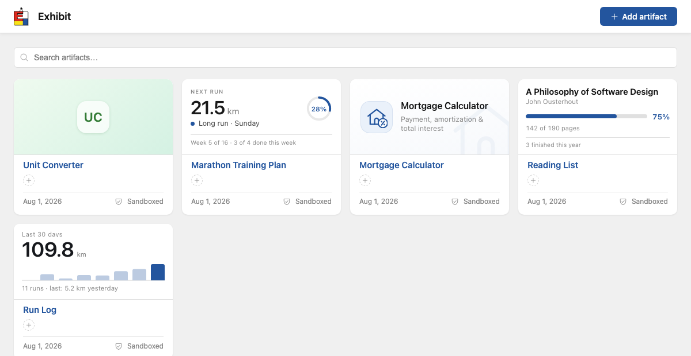
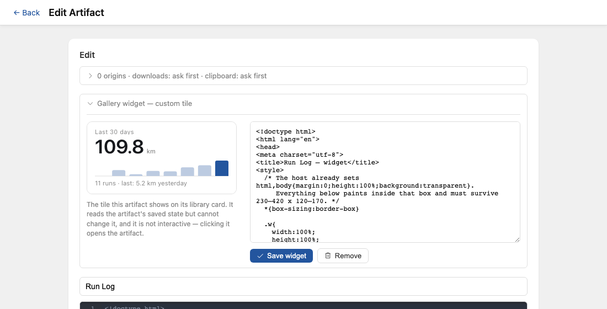
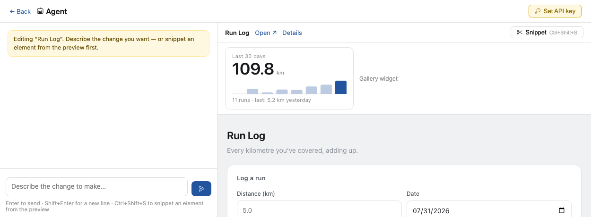

# Exhibit — Artifact widgets

Proof-of-concept feature (`av-fafu`). An artifact may carry a **widget**: a
second self-contained HTML document that renders inside the artifact's card in
the library, showing one fact from the tool's own saved state — the way an iOS
home-screen widget shows a slice of its app.



```
┌─────────────────────────────┐
│      Last 30 days           │   ← the widget: RENDER_ORIGIN/w/:id in a
│      109.8 km               │     sandboxed iframe, pointer-events: none
│      ▁▂▁▂▃▃█                │
├─────────────────────────────┤
│ Run Log                     │   ← the card, unchanged
│ Aug 1, 2026     ⛨ Sandboxed │
└─────────────────────────────┘
       a click anywhere opens the artifact
```

## What a widget is

- **A view of the artifact's state.** The render surface inlines the artifact's
  server-persisted state into the widget exactly as it does for the artifact,
  so a plain synchronous `localStorage.getItem` at startup is correct. The
  widget reads the same keys the tool writes. Because state lives on the
  server, the tile shows the same numbers on every device.
- **Read-only.** `setItem` updates the widget's own in-memory cache and stops
  there — the write-through to the host frame is short-circuited. A tile cannot
  change the library it is displayed in.
- **Not interactive.** The frame is `pointer-events: none` and `tabindex="-1"`:
  clicks, drags and scrolls pass through to the card, whose handler opens the
  artifact. This is why "informative only" needs no event plumbing to enforce.
- **Under the artifact's security envelope, never its own.** Same opaque-origin
  sandbox, same per-artifact CSP built from the same allowlist. No download
  bridge, no clipboard bridge, no file-picker polyfill, no element picker.
- **Optional.** No widget means the card renders a **default tile** — a
  monogram on a tint derived from the artifact's id, plain server-rendered
  markup with no frame to load.

A **static widget** is just a widget with no `<script>`: the natural answer for
a stateless tool (a calculator, a converter) that has nothing to report but
still wants a face. There is no separate mechanism for it.

## Where it lives

| Surface | What it does |
|---|---|
| `GET RENDER_ORIGIN/w/:artifactID` | Serves the widget document (`internal/render`). 404 when the artifact has none. |
| Gallery card | Frames the widget, or renders the default tile (`cardWidget` partial). |
| Artifact edit page | "Gallery widget" panel: source editor, live preview, Save / Remove. |
| Agent chat | `set_widget` / `get_widget` tools; the preview pane shows the tile. |
| `GET/PUT/DELETE /api/artifacts/:id/widget` | The single write path, like every other mutation. |

The edit panel previews the tile at its real size beside its source, and swaps
the `/partials/card-widget` fragment after a save rather than reloading the page
out from under the artifact's editor:



The agent's preview pane carries the tile above the live artifact, so a
`set_widget` call lands somewhere the user is already watching:



## Why these shapes

**A column, not a second artifacts row.** A widget has no independent identity,
no allowlist of its own and no state of its own. Modelling it as
`artifacts.widget_blob_id` makes that one-to-one binding a schema fact instead
of a convention two tables have to keep agreeing on. The body itself is a blob
beside the artifact's own source, because it *is* a body.

**One preamble, narrowed — not a second shim.** `injectPreamble(…, widget)`
emits the same storage shim with `WIDGET = true`, which short-circuits
`writeThrough`, and it splices in `bridgeScript` only for artifacts. So "a
widget's authority is a strict subset of its artifact's" is a property you can
read off one file. Omitting the bridges rather than disabling them is also the
cheap choice: a gallery page renders one widget document per card, and none of
them should carry a download bridge they cannot use. (A widget doc runs ~13 KB
of preamble against the artifact's ~34 KB.)

**One CSP.** `serveDoc` builds the policy from the artifact's allowlist
whichever document it is serving. A widget can therefore never reach an origin
the artifact was not approved for, and there is no second policy to drift.
`PUT /widget` still *reports* the widget's footprint and which origins the
allowlist doesn't cover — those are already blocked, and a blocked origin
otherwise shows up as a mysteriously blank tile. Reporting never approves:
scans do not seed the allowlist (spec §6.2).

**No live-update channel.** A widget renders from state inlined at request
time, and its document is `Cache-Control: no-store`, so every gallery load
shows current data. State that changes while a card is on screen does not push
into it — the next render picks it up. For a glanceable tile that is the right
trade: no sockets, no polling, no per-card subscriptions.

## Writing a widget

The render preamble sets `html,body{margin:0;height:100%;background:transparent}`
and a `system-ui` font before the widget's markup, so the tile starts from a
sane floor and can override anything.

- Design for roughly **272 × 132 CSS px**, fluid from 230 to 420 wide. Use
  `width/height: 100%` and flexbox; never a fixed pixel layout width.
- Show **one** fact, large and legible, plus at most one quiet supporting line.
- Read the artifact's key **synchronously at startup**, and tolerate it being
  missing or malformed.
- Always render a calm **empty state** — never `NaN`, `undefined`, or a blank
  box.
- Never draw a button, input, link, or anything that looks tappable.
- One file, everything inline, no external references, inline SVG for charts
  and glyphs.
- Style for a light card: `#fff` surface, accent `#23559e`, muted `#888`,
  hairline `#e0e0e0`.

The agent's system prompt carries this same contract, so `set_widget` output
follows it without being told each time.

## Samples (`dev/samples/`)

Five samples cover every widget mode. Load them into a running dev server with:

```
make run                            # terminal 1
python3 scripts/seed-samples.py     # terminal 2
```

| Sample | Widget mode |
|---|---|
| `run-tracker` | Live state — 30-day distance total plus a weekly sparkline |
| `marathon-plan` | Live state — the next scheduled run, derived from the plan |
| `reading-list` | Live state — current book and reading progress |
| `mortgage-calculator` | **Static** — an identity card with no `<script>`; the tool is stateless |
| `unit-converter` | **None** — opts out, so the card falls back to the default tile |

Each sample directory holds `artifact.html`, an optional `widget.html`, and an
optional `state.json` of demo state. The seeder upserts by title (so re-running
refreshes in place) and expands `{{date:N}}` / `{{monday:N}}` tokens, which is
what keeps "last 30 days" demo data from ageing into an empty widget.

## Known limits (POC)

- Shares (`/s/:shareID`) serve the artifact only; there is no shared widget.
- The tile is a fixed 132 px tall. There is no small/medium/large family.
- A widget does not re-render while its card is on screen (see above).
- `Blob.Store` has no `Delete`, so removing a widget orphans its blob — the
  same v1 behaviour as deleting an artifact.
